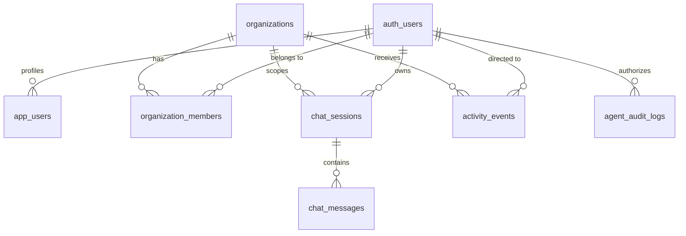

# 🗄️ Database Schema & Tenancy Model: Prism V2

> **Document Status**: LOCKED FOR MVP  
> **Backend Storage**: Supabase (PostgreSQL 16 with Row Level Security)  
> **Isolation Guarantee**: Multi-Tenant Schema Isolation + Auth Scoped RLS
> **📌 Canonical Source of Truth**: The executable schema lives in `database/migrations/` (migrations 01–10). The SQL below is the **reference contract** for what those migrations must produce; where prose and migrations disagree, the migration files win and this document gets updated. V2 schema deltas (role `'tool'` on `chat_messages`, canonical `agent_audit_logs` ledger, `activity_events`) are created by migration 10 per the runbook's conflict-resolution block.

---

## 1. Tenancy Model Overview

Prism V2 operates on an **Organization-Centric, User-Isolated Multi-Tenant Model**:
- **Authentication**: Powered by Supabase Auth (`auth.users`).
- **Organizations**: Users belong to one or more organizations (`organizations`).
- **Membership & RBAC**: Roles (`owner`, `admin`, `member`) are enforced via `organization_members`.
- **Row Level Security (RLS)**: No table allows cross-organization or cross-user data leakage. All client requests operate under `auth.uid()`.
- **Tool Sessions**: Every user has their own private Composio connection workspace (`entity_id = auth.uid()`), while organizational connections are scoped to `organization_id`.



---

## 2. Core Tables Specification

### 2.1 `public.app_users`
Profiles for authenticated users linked to Supabase Auth.
```sql
CREATE TABLE IF NOT EXISTS public.app_users (
  id UUID PRIMARY KEY DEFAULT gen_random_uuid(),
  auth_user_id UUID UNIQUE REFERENCES auth.users(id) ON DELETE CASCADE,
  email TEXT NOT NULL UNIQUE,
  display_name TEXT,
  avatar_url TEXT,
  role TEXT NOT NULL DEFAULT 'member' CHECK (role IN ('owner', 'admin', 'member')),
  composio_entity_id TEXT, -- Stable Composio identity (defaults to auth_user_id)
  created_at TIMESTAMPTZ NOT NULL DEFAULT NOW(),
  updated_at TIMESTAMPTZ NOT NULL DEFAULT NOW()
);
```

### 2.2 `public.organizations` & `public.organization_members`
Multi-tenant workspaces supporting enterprise teams.
```sql
CREATE TABLE IF NOT EXISTS public.organizations (
  id UUID PRIMARY KEY DEFAULT gen_random_uuid(),
  name TEXT NOT NULL,
  slug TEXT UNIQUE NOT NULL,
  owner_id UUID REFERENCES auth.users(id) ON DELETE CASCADE,
  type TEXT NOT NULL DEFAULT 'personal' CHECK (type IN ('personal', 'team', 'enterprise')),
  created_at TIMESTAMPTZ NOT NULL DEFAULT NOW(),
  updated_at TIMESTAMPTZ NOT NULL DEFAULT NOW()
);

CREATE TABLE IF NOT EXISTS public.organization_members (
  id UUID PRIMARY KEY DEFAULT gen_random_uuid(),
  organization_id UUID NOT NULL REFERENCES public.organizations(id) ON DELETE CASCADE,
  user_id UUID NOT NULL REFERENCES auth.users(id) ON DELETE CASCADE,
  role TEXT NOT NULL DEFAULT 'member' CHECK (role IN ('owner', 'admin', 'member')),
  joined_at TIMESTAMPTZ NOT NULL DEFAULT NOW(),
  UNIQUE(organization_id, user_id)
);
```

> No billing `plan` column for MVP — billing is deferred post-MVP. The live schema (migration 05) uses `type` with the enum above; a `plan` column may be added post-MVP if pricing tiers ship.

### 2.3 `public.chat_sessions` & `public.chat_messages`
Persisted, resumable conversation threads with full execution history and interactive artifacts.
```sql
CREATE TABLE IF NOT EXISTS public.chat_sessions (
  id UUID PRIMARY KEY DEFAULT gen_random_uuid(),
  organization_id UUID REFERENCES public.organizations(id) ON DELETE CASCADE,
  user_id UUID NOT NULL REFERENCES auth.users(id) ON DELETE CASCADE,
  title TEXT NOT NULL DEFAULT 'New Briefing',
  is_archived BOOLEAN NOT NULL DEFAULT FALSE,
  pinned BOOLEAN NOT NULL DEFAULT FALSE,
  created_at TIMESTAMPTZ NOT NULL DEFAULT NOW(),
  updated_at TIMESTAMPTZ NOT NULL DEFAULT NOW()
);

CREATE TABLE IF NOT EXISTS public.chat_messages (
  id UUID PRIMARY KEY DEFAULT gen_random_uuid(),
  session_id UUID NOT NULL REFERENCES public.chat_sessions(id) ON DELETE CASCADE,
  role TEXT NOT NULL CHECK (role IN ('user', 'assistant', 'system', 'tool')),
  content TEXT NOT NULL,
  tool_calls JSONB DEFAULT '[]'::JSONB,         -- Captured tool invocations & outputs
  action_proposals JSONB DEFAULT '[]'::JSONB,   -- State-modifying actions requiring sign-off
  created_at TIMESTAMPTZ NOT NULL DEFAULT NOW()
);
```

> **Migration delta (migration 10)**: the live `chat_messages.role` CHECK (migration 05) allows only `user`/`assistant`/`system`; migration 10 must drop and re-add it to include `'tool'` so captured tool invocations can be persisted. The live table also carries `source_badges TEXT[] NOT NULL DEFAULT '{}'` — keep it, it feeds source attribution in the stream.

### 2.4 `public.activity_events` (Live Stack Telemetry Feed)
Stores real-time inbound updates received from Composio Webhook triggers (Teams, Outlook, Slack, etc.).
```sql
CREATE TABLE IF NOT EXISTS public.activity_events (
  id UUID PRIMARY KEY DEFAULT gen_random_uuid(),
  organization_id UUID REFERENCES public.organizations(id) ON DELETE CASCADE,
  user_id UUID REFERENCES auth.users(id) ON DELETE CASCADE,
  source TEXT NOT NULL,                         -- 'microsoft.teams', 'microsoft.outlook', 'slack', etc.
  event_type TEXT NOT NULL,                     -- 'TEAMS_NEW_MESSAGE', 'OUTLOOK_URGENT_EMAIL', etc.
  title TEXT NOT NULL,
  summary TEXT,
  priority TEXT NOT NULL DEFAULT 'normal' CHECK (priority IN ('low', 'normal', 'urgent', 'critical')),
  raw_payload JSONB NOT NULL DEFAULT '{}'::JSONB,
  is_read BOOLEAN NOT NULL DEFAULT FALSE,
  actionable BOOLEAN NOT NULL DEFAULT FALSE,    -- True if Copilot can act on this event
  created_at TIMESTAMPTZ NOT NULL DEFAULT NOW()
);

CREATE INDEX idx_activity_events_user ON public.activity_events(user_id, created_at DESC);
CREATE INDEX idx_activity_events_org ON public.activity_events(organization_id, created_at DESC);
```

**Event ownership (single authority)**: Inbound webhook inserts are performed by the **service role** (`SUPABASE_SERVICE_ROLE_KEY`) — RLS therefore plays no role on the write path. The webhook handler resolves ownership itself: `user_id` = the Composio session's user (from the trigger payload), `organization_id` = that user's primary organization. The handler MUST reject payloads with an unresolvable `user_id` instead of inserting an orphan event. Client reads are scoped by the single RLS policy in §3 (own rows or org membership); Realtime subscriptions inherit the same policy.

### 2.5 `public.agent_audit_logs` (Human-in-the-Loop Sign-Off)
Strict immutable ledger of every write, send, delete, or external update performed by the Copilot.

> **⚠️ Existing table collision**: migration 09 already created `agent_audit_logs` with an **org-event shape** (`action`, `entity_type`, `entity_id`, `details`). Migration 10 renames it to `agent_audit_logs_legacy` and creates the canonical HITL ledger. **Migration 10 is the authoritative DDL**; the canonical shape is:

| Column | Type | Notes |
| :--- | :--- | :--- |
| `id` | `UUID PK` | default `gen_random_uuid()` |
| `organization_id` | `UUID → organizations` | on delete cascade |
| `user_id` | `UUID NOT NULL → auth.users` | on delete cascade |
| `tool_slug` | `TEXT NOT NULL` | e.g. `outlook_send_email` |
| `action_type` | `TEXT NOT NULL` | `EMAIL_SENT`, `RECORD_CREATED`, … |
| `status` | `TEXT CHECK` | `pending / approved / rejected / executed / failed` |
| `request_payload` | `JSONB NOT NULL` | exact parameters proposed to the tool |
| `execution_result` | `JSONB` | provider response or error |
| `approved_by` | `UUID → auth.users` | on delete set null |
| `approved_at` | `TIMESTAMPTZ` | sign-off timestamp |
| `created_at` | `TIMESTAMPTZ` | default `NOW()` |

---

## 3. Row Level Security (RLS) Policies

All tables have RLS enabled. No client can execute raw queries that leak other tenants' data:

1. **User Isolation**:
   ```sql
   ALTER TABLE public.chat_sessions ENABLE ROW LEVEL SECURITY;
   CREATE POLICY "Users can only access their own sessions"
     ON public.chat_sessions
     FOR ALL
     USING (auth.uid() = user_id);
   ```

2. **Organization Scoping**:
   ```sql
   ALTER TABLE public.activity_events ENABLE ROW LEVEL SECURITY;
   CREATE POLICY "Users see events for their org or personal user_id"
     ON public.activity_events
     FOR SELECT
     USING (
       auth.uid() = user_id OR
       organization_id IN (
         SELECT organization_id FROM public.organization_members WHERE user_id = auth.uid()
       )
     );
   ```

3. **Write Authority (stated once)**: All client-facing tables are read-scoped by the policies above; **all writes go through the service role** (webhook ingestion, approval execution, message persistence). Do not create additional org-insert or write policies for `activity_events` — ownership resolution happens in the webhook handler (see §2.4).
