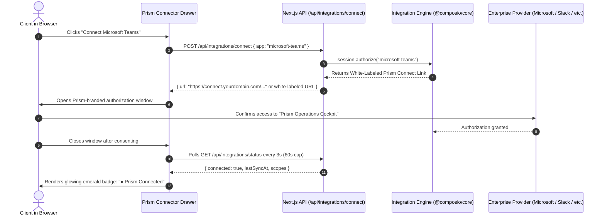

# 🔌 Integrations & Engine Architecture: Prism Universal Connector Hub

> **Document Status**: LOCKED FOR MVP  
> **Brand Directive**: **100% PRISM BRAND SOVEREIGNTY**.
> **Execution Engine**: Composio Platform SDK (`@composio/core`) running in White-Labeled Mode.  
> **Credential Paradigm**: Managed Connect Links styled with Prism branding + Custom Auth Configs.

---

## 1. Zero Third-Party Branding Policy (Prism Brand Sovereignty)

Every touchpoint experienced by clients, users, or workspace administrators must exclusively bear the **Prism** identity:

| User Surface | What the Client Sees | Backend Mechanism |
| :--- | :--- | :--- |
| **Drawer & Connect Hub** | **"Prism Integrations Hub"** / **"Connect to Prism"** | Custom UI in `ToolDrawer.tsx` |
| **Hosted Connect Window** | Prism Logo, Obsidian Dark Theme, *"Authorize Prism to access..."* | Composio Dashboard → Project Settings → **White Labeling** |
| **OAuth Consent Screen** | *"Prism wants to access your Microsoft/Slack account"* | **Custom Auth Config** configured in Composio using Prism's Azure/Slack Client IDs |
| **Action Cards & Approval** | **"Prism Action Proposal"** / **"Deliver via Prism"** | Bespoke `ActionCard.tsx` component |
| **Error / Reconnect Banners** | *"Prism lost connection to Outlook. Re-authorize Prism."* | Clean client error boundary mapping |

---

## 2. Multi-User Session Architecture

The integration engine models identity through isolated user sessions:
- A session is the runtime sandbox for a single authenticated user (`auth.uid()`).
- Connections, credentials, and tool permissions are strictly tied to that session.
- No two users ever share access tokens or connection state.

```typescript
// frontend/src/lib/composio/session.ts
import { Composio } from "@composio/core";

export async function getComposioSessionForUser(userId: string) {
  const composio = new Composio();
  const session = await composio.sessions.create(userId);
  return { session };
}
```

> **Build-time verification rule**: Before implementing, confirm method signatures, tool/trigger slugs, and the webhook signature header spec against the current docs at `docs.composio.dev` for the installed `@composio/core` version.

---

## 3. The 1-Click "Prism Connect" Flow

(Keep the existing mermaid sequence diagram exactly as-is)



---

## 4. White-Label Configuration Checklist

To guarantee zero brand leakage:
1. **App Title & Branding**: Set App Title to `Prism` and upload the official vector logo.
2. **Custom Domain Proxy (Optional Post-MVP)**: Route connect links through `auth.prism.app`.
3. **Custom OAuth Apps**: Azure AD, Google Workspace, and Slack Apps are named **Prism**.

---

## 5. Tool Injection into the Agent Loop

When the user asks a question in the Copilot view, the Next.js server pulls the active tools for that specific user. Crucially, tools from MULTIPLE authenticated services are loaded together into a unified toolset.

```typescript
// src/lib/agent/executor.ts
import { getPrismSessionForUser } from "@/lib/integrations/session";

export async function getActiveToolsForUser(userId: string) {
  const { session } = await getPrismSessionForUser(userId);
  
  // session.tools() fetches ALL tools across ALL connected integrations 
  // (e.g., GitHub, Jira, Outlook, Salesforce) and returns them as an array 
  // of JSON Schema-compliant tool definitions.
  const tools = await session.tools();
  
  return { session, tools };
}
```

Because all connected tools are injected at once into the LLM's context window, the agent sees a comprehensive toolkit. It isn't restricted to interacting with one integration per prompt. If a tool requires an authentication that the user hasn't completed yet, the agent generates a native **Prism Connect Pill** directly in the stream, inviting the user to authorize without leaving the chat.

---

## 6. Cross-Tool Orchestration Architecture

The real value of Prism lies in cross-tool orchestration. Prism is not simply a directory of 1,000 independent tools; it is a personal assistant capable of chaining tool calls across distinct services seamlessly. 

### Unified Context for the LLM
Because the agent receives tools from all connected integrations in a single tool call context, it acts as a central intelligence layer. The LLM's native function-calling loop allows it to execute a sequence of actions:
1. Call Tool A (from Service X).
2. Receive the result of Tool A.
3. Call Tool B (from Service Y) using data extracted from the result of Tool A.

### Concrete Orchestration Examples

- **Cross-Service Data Synthesis**
  The user asks, *"Can you give me an update on our current sprint progress?"* 
  1. The agent calls Jira to fetch tickets in the current sprint.
  2. The agent calls a secondary service to cross-reference or enrich the data retrieved from the first service.
  3. The agent synthesizes a comprehensive progress report showing which tickets are waiting on PR reviews and which are merged.

- **Multi-Step Batch Operations**
  The user asks, *"Please run a follow-up workflow for all overdue accounts."*
  1. The agent calls the CRM (e.g., Salesforce) to query clients with invoices >30 days overdue, retrieving their names, emails, and balances.
  2. The agent calls an execution service (e.g., Email or Messaging) to draft and stage actions for each record found in the previous step.

### System Prompt Engineering
To enable this behavior, the agent is provided with an orchestrated system prompt that emphasizes its role as a cross-functional assistant. The system prompt guides the LLM to look for opportunities to bridge gaps between different systems, ensuring it understands how distinct records across different tools represent the same unit of work or target.
