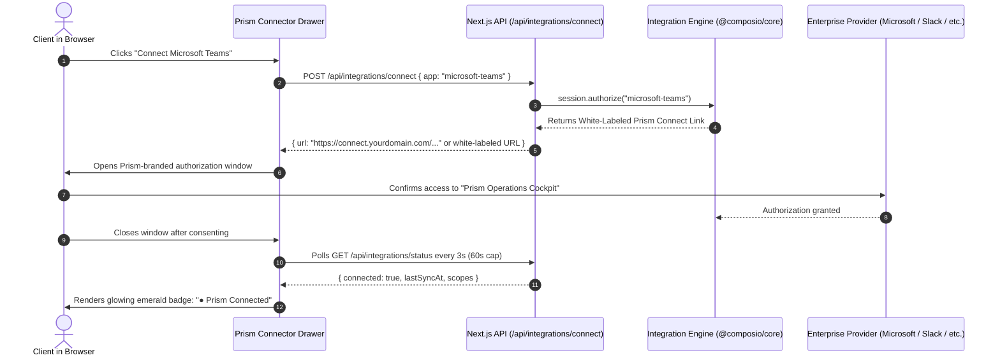

# 🔌 Integrations & Engine Architecture: Prism Universal Connector Hub

> **Document Status**: LOCKED FOR MVP  
> **Brand Directive**: **100% PRISM BRAND SOVEREIGNTY**. To end-users and clients, the product is 100% **Prism**. Third-party provider names (Composio) are strictly internal backend implementation details and MUST NEVER appear anywhere in the client-facing UI, URLs, modals, badges, or error messages.  
> **Execution Engine**: Composio Platform SDK (`@composio/core`) running in White-Labeled Mode.  
> **Credential Paradigm**: Managed Connect Links styled with Prism branding + Custom Auth Configs.

---

## 1. Zero Third-Party Branding Policy (Prism Brand Sovereignty)

Every touchpoint experienced by clients, users, or workspace administrators must exclusively bear the **Prism** identity:

| User Surface | What the Client Sees | Backend Mechanism |
| :--- | :--- | :--- |
| **Drawer & Connect Hub** | **"Prism Integrations Hub"** / **"Connect to Prism"** | Custom UI in `ToolDrawer.tsx` |
| **Hosted Connect Window** | Prism Logo, Obsidian Dark Theme, *"Authorize Prism to access..."* | Composio Dashboard → Project Settings → **White Labeling** (Title: *Prism*, Logo: `/prism-logo.svg`, Theme: `#0B0D13`) |
| **OAuth Consent Screen** | *"Prism wants to access your Microsoft/Slack account"* | **Custom Auth Config** configured in Composio using Prism's Azure/Slack Client IDs |
| **Action Cards & Approval** | **"Prism Action Proposal"** / **"Deliver via Prism"** | Bespoke `ActionCard.tsx` component |
| **Error / Reconnect Banners** | *"Prism lost connection to Outlook. Re-authorize Prism."* | Clean client error boundary mapping |

---

## 2. Multi-User Session Architecture

The integration engine models identity through isolated user sessions:
- A session is the runtime sandbox for a single authenticated user (`auth.uid()`).
- Connections, credentials, and tool permissions are strictly tied to that session.
- No two users ever share access tokens or connection state.

```typescript
// frontend/src/lib/composio/session.ts
import { Composio } from "@composio/core";

export async function getComposioSessionForUser(userId: string) {
  const composio = new Composio(); // Uses process.env.COMPOSIO_API_KEY internally

  // Create or retrieve a Tool Router session scoped to this authenticated user.
  // `config` (ToolRouterCreateSessionConfig) is optional: pass `toolkits`,
  // `manageConnections`, etc. as needed. See @composio/core `Sessions.create`.
  const session = await composio.sessions.create(userId);
  return { session };
}
```

> **Build-time verification rule**: Before implementing, confirm method signatures, tool/trigger slugs, and the webhook signature header spec against the current docs at `docs.composio.dev` for the installed `@composio/core` version. Never invent toolkits or tool slugs — discover them at runtime or via the Composio CLI.

---

## 3. The 1-Click "Prism Connect" Flow

Instead of exposing complex vendor URLs or third-party brands, the client initiates a seamless **Prism Connect** flow:



---

## 4. White-Label Configuration Checklist

To guarantee zero brand leakage:
1. **App Title & Branding**: Set App Title to `Prism` and upload the official vector logo in project settings.
2. **Custom Domain Proxy (Optional Post-MVP)**: Route connect links through `auth.prism.app` so third-party domains are hidden in the browser address bar.
3. **Custom OAuth Apps**: Azure AD, Google Workspace, and Slack Apps are named **Prism** with the Prism logo and privacy policy URLs so provider consent dialogs say *"Prism is requesting permission"*.

---

## 5. Tool Injection into the Agent Loop

When the user asks a question in the Copilot view, the Next.js server pulls the active tools for that specific user:

```typescript
// src/lib/agent/executor.ts
import { getPrismSessionForUser } from "@/lib/integrations/session";

export async function getActiveToolsForUser(userId: string) {
  const { session } = await getPrismSessionForUser(userId);
  const tools = await session.tools();
  return { session, tools };
}
```

If a tool requires an authentication that the user hasn't completed yet, the agent generates a native **Prism Connect Pill** directly in the stream, inviting the user to authorize without leaving the chat.
