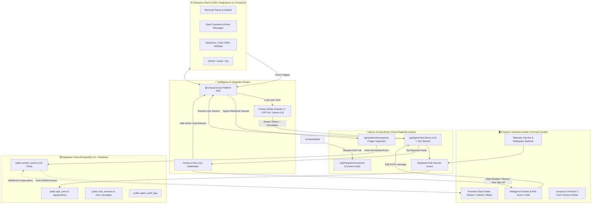

# 🏛️ System Architecture: Prism Copilot V2 (The AI Employee Platform)

> **Document Status**: LOCKED FOR MVP  
> **Target Aesthetic & Model**: Viktor-grade AI Employee Platform ([viktor.com](https://viktor.com/))  
> **Core Philosophy**: *"Not a chat tool. A digital employee that lives across your stack, fetches live communication, proposes actions, and waits for your sign-off before touching what matters."*

---

## 1. Executive Summary & Paradigm Shift

The legacy architecture operated as an n8n webhook proxy with custom-built OAuth connectors for individual vendors (Zoho, Azure Graph). This introduced three fatal bottlenecks:
1. **Connector Scalability Barrier**: Building vendor OAuth, token encryption, and API wrappers manually took 1–3 weeks per integration.
2. **Execution Latency & Fragility**: Next.js proxied prompts to an n8n webhook through ngrok/tunnels, and used brittle regex parsing on n8n logs (`Calling tools:...`) to extract SSE events.
3. **Passive Chatbot UX**: The interface was a standard reactive chat window instead of a proactive operations cockpit that monitors communication across Teams, Outlook, and Slack.

**Prism V2 completely re-architects the system around three modern pillars**:
1. **Composio Platform SDK**: Universal multi-user integration infrastructure. 3,200+ enterprise tools (Teams, Outlook, Slack, Linear, GitHub, Zoho, Salesforce) accessible with zero custom OAuth boilerplate. User connections are strictly isolated per Supabase user session (`composio.sessions.create(userId)`).
2. **Direct Edge/Serverless Agent Runtime**: The LLM (Claude 3.7 / GPT-4o / Gemini 2.0) executes tools directly inside Next.js via streaming Server-Sent Events (SSE). Latency drops by 75% with sub-second Time-To-First-Token (TTFT). n8n is completely removed from the real-time chat loop.
3. **Live Stack Radar & Telemetry**: Composio Webhook Triggers push real-time events (incoming Teams messages, urgent Outlook emails, CRM deals) into Supabase, which live-streams them to an ambient cockpit HUD.

---

## 2. High-Level System Blueprint

---

## 3. Technology Stack & Role Matrix

| Layer | Selected Technology | Architectural Role | Why It Beats the Legacy Architecture |
| :--- | :--- | :--- | :--- |
| **Framework** | **Next.js 16 (App Router)** | Primary full-stack runtime, API routes, Server Actions, edge streaming. | Single, unified TypeScript codebase; avoids dual-dispatch legacy mess. |
| **Styling & Motion** | **Vanilla Tailwind CSS + Framer Motion** | Obsidian/Titanium hardware aesthetics, fluid micro-interactions, double-bezel nesting. | 100% bespoke design system; zero cookie-cutter AI templates. |
| **Authentication & DB** | **Supabase Auth + PostgreSQL + Realtime** | Multi-tenant auth, organization membership, RLS policies, live event websockets. | Enterprise-grade isolation with zero credential leakage. |
| **Tool Execution** | **Composio Platform SDK (`@composio/core`)** | Multi-user session management, 3,200+ pre-built integrations, OAuth connect links. | Replaces manual OAuth & token vault maintenance; adds instant support for all tools. |
| **Agent Intelligence** | **Frontier LLMs (Claude 3.7 / GPT-4o / Gemini 2.0)** | Direct tool-calling orchestrator with streaming output. | Replaces slow n8n LangChain proxy; reduces TTFT from 3.5s to <500ms. |
| **Live Telemetry** | **Composio Webhook Triggers + Supabase Realtime** | Real-time event ingestion for Teams, Outlook, Slack, and CRMs. | Enables the Viktor proactive capability without writing custom polling crons. |

---

## 4. The Decision on n8n (Formal Architectural Verdict)

### Why n8n was Retired from the Interactive Agent:
1. **Middleman Latency**: In the legacy build, every chat message had to hop from browser → Next.js → ngrok/tunnel → n8n → LLM → tool → n8n → Next.js regex scraper → browser. Removing n8n cuts latency by ~70%.
2. **Regex Parsing Fragility**: The old `/api/chat/route.ts` used 150 lines of complex regular expressions to parse n8n console stdout into SSE frames. Direct LLM tool calling returns structured JSON natively.
3. **Tunneling & Ops Overhead**: Running a local or cloud n8n instance required public webhook tunneling, separate authentication, and container maintenance.

### Where n8n Remains Optional:
n8n is strictly relegated to **asynchronous, non-real-time batch operations** (e.g., scheduled weekly data reconciliations or legacy visual workflows for non-developers). It is completely decoupled from the user-facing Copilot.

---

## 5. Security & Boundary Guardrails

1. **Zero Shared Tokens**: No tokens are stored in plain text or shared across users. Composio manages credentials in compliance with SOC 2 / HIPAA.
2. **Session Scoping**: Every Composio call is isolated using `composio.sessions.create(supabaseUser.id)`. User A cannot see or trigger User B’s tools.
3. **Approval Gates for Mutations**: Any tool marked as `state_mutation` (e.g., `SEND_MAIL`, `UPDATE_RECORD`, `DELETE_OBJECT`) emits an approval token and is blocked until the user explicitly confirms via the UI.
