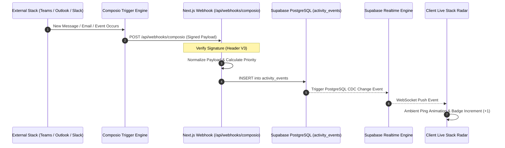

# 📡 Proactive Live Stack Telemetry & Webhook Architecture

> **Document Status**: LOCKED FOR MVP  
> **Telemetry Source**: Composio Webhook Triggers (Hybrid Real-time & Polling)  
> **Client Dispatch**: Supabase Realtime (WebSocket PostgreSQL Changes)

---

## 1. The Proactive Paradigm

Traditional chatbots are completely passive: they sit empty until the user sends a message.  
**Viktor’s breakthrough is proactivity**: it monitors what is happening in the company's communication channels and alerts the user to what matters.

Prism V2 achieves this using **Composio Webhook Triggers**:
1. When a user connects Microsoft Teams, Outlook, or Slack, Composio activates trigger subscriptions for that account.
2. Whenever an event occurs (new email arrived, channel message posted, deal updated), Composio delivers a signed webhook to our application.
3. Our backend normalizes the event, classifies urgency, and writes it to `public.activity_events`.
4. Supabase Realtime pushes the event across WebSocket channels directly to the user's browser, updating the **Live Stack Radar** in real-time.



---

## 2. Ingestion Route Specification (`/api/webhooks/composio`)

### Signature Verification & Parsing
Composio implements the **Standard Webhook Specification**:
- Webhooks include headers: `x-composio-webhook-id`, `x-composio-webhook-timestamp`, `x-composio-webhook-signature`.
- The webhook endpoint verifies the payload against the project's secret before processing.

```typescript
// src/app/api/webhooks/composio/route.ts
import { NextResponse } from 'next/server';
import { adminSupabase } from '@/lib/supabase-admin';

export async function POST(req: Request) {
  try {
    const rawBody = await req.text();
    const signature = req.headers.get('x-composio-webhook-signature');
    
    // In production: Verify signature with crypto.subtle / hmac
    const payload = JSON.parse(rawBody);
    const { trigger_name, data, user_id } = payload;

    // Normalize event format
    const normalized = normalizeTriggerEvent(trigger_name, data);
    if (!normalized) {
      return NextResponse.json({ ignored: true }, { status: 200 });
    }

    // Service-role insert (bypasses RLS): ownership is resolved here — user_id from
    // the trigger payload, organization_id from the user's primary org (see
    // docs/01-architecture/DATABASE_AND_TENANCY.md §2.4). Reject unresolvable user_id.
    const { error } = await adminSupabase.from('activity_events').insert({
      user_id: user_id,
      organization_id: userOrgId,
      source: normalized.source,
      event_type: trigger_name,
      title: normalized.title,
      summary: normalized.summary,
      priority: normalized.priority,
      raw_payload: data,
      actionable: normalized.actionable,
    });

    if (error) {
      console.error('[Webhook] DB Insert failed:', error);
      return NextResponse.json({ error: error.message }, { status: 500 });
    }

    return NextResponse.json({ status: 'received' }, { status: 200 });
  } catch (err: any) {
    console.error('[Webhook] Processing error:', err);
    return NextResponse.json({ error: 'Internal server error' }, { status: 500 });
  }
}
```

---

## 3. Real-Time Client Subscription Hook

On the frontend, the `LiveStackRadar` subscribes to changes on the `activity_events` table using the authenticated user's session:

```typescript
// src/hooks/useLiveStackRadar.ts
import { useEffect, useState } from 'react';
import { createClient } from '@/lib/supabase/client';
import { TelemetryEvent } from '@/types/copilot';

export function useLiveStackRadar(userId: string) {
  const [events, setEvents] = useState<TelemetryEvent[]>([]);
  const supabase = createClient();

  useEffect(() => {
    // 1. Initial Load of recent events
    supabase
      .from('activity_events')
      .select('*')
      .eq('user_id', userId)
      .order('created_at', { ascending: false })
      .limit(20)
      .then(({ data }) => {
        if (data) setEvents(data);
      });

    // 2. Realtime WebSocket Channel
    const channel = supabase
      .channel(`live-radar-${userId}`)
      .on(
        'postgres_changes',
        {
          event: 'INSERT',
          schema: 'public',
          table: 'activity_events',
          filter: `user_id=eq.${userId}`,
        },
        (payload) => {
          const newEvent = payload.new as TelemetryEvent;
          setEvents((prev) => [newEvent, ...prev.slice(0, 49)]);
        }
      )
      .subscribe();

    return () => {
      supabase.removeChannel(channel);
    };
  }, [userId]);

  return { events };
}
```
