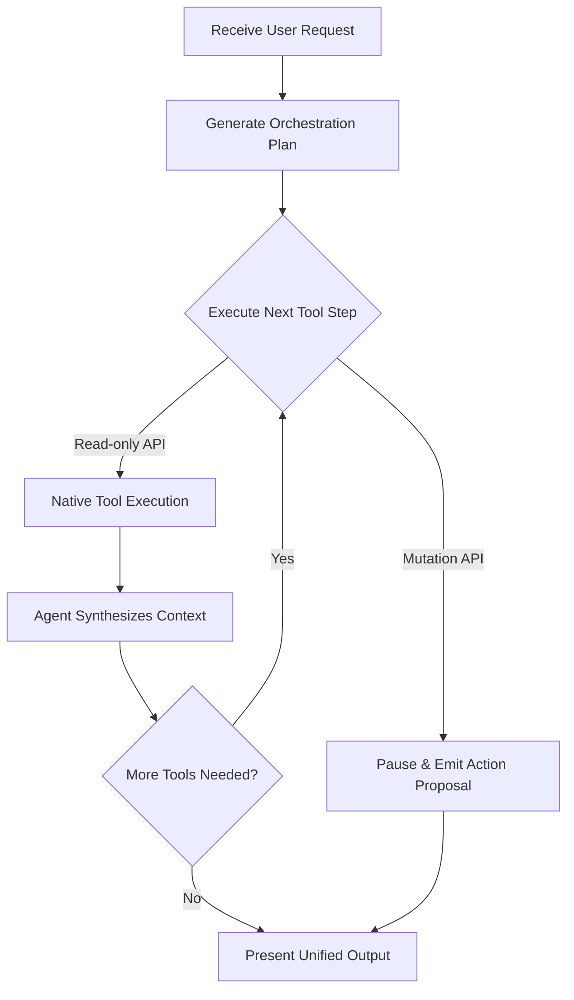

# ⚡ Agent Execution Engine & Direct Streaming Runtime

> **Document Status**: LOCKED FOR MVP  
> **Runtime**: Next.js 16 Edge / Serverless API Route (`POST /api/agent/chat`)  
> **LLM Provider Compatibility**: Anthropic Claude 3.7 / OpenAI GPT-4o / Google Gemini 2.0  
> **Tool Execution**: Direct Native Calling via `@composio/core` (Zero n8n Middleman)  
> **Resilience Guardrails**: 15s Heartbeat Keep-Alive, SSE Backpressure, and Cryptographic Tamper-Proof Proposals

---

## 1. Architectural Comparison: Legacy vs. Prism V2

```text
LEGACY EXECUTION PIPELINE (High Latency, High Fragility):
Browser 
  ──(POST /api/chat)──▶ Next.js Proxy 
  ──(Webhook over ngrok)──▶ n8n Server 
  ──(LangChain Node)──▶ LLM 
  ──(Custom Python Tool)──▶ Vendor API 
  ──(Text Logs)──▶ Next.js Regex Scraper 
  ──(SSE)──▶ Browser
  Latency: 3.5s - 7.0s TTFT | Brittle Regex Parsing | Webhook Timeouts

PRISM V2 NATIVE STREAMING RUNTIME (Blazing Fast, Deterministic):
Browser 
  ──(POST /api/agent/chat)──▶ Next.js Serverless Route
  ├── Verify Supabase Auth (auth.uid)
  ├── Load Composio User Session (composio.sessions.create(uid))
  ├── Multi-Step Orchestration Loop (LLM ⇄ Composio)
  │     ├── Generate Orchestration Plan
  │     ├── Execute Tool Sequence (Parallel/Sequential)
  │     │     ├── Read-only Tool ──▶ Instant Auto-Execution
  │     │     └── Mutation Tool  ──▶ Emits Action Proposal Card
  │     └── Synthesize & Chain Further Actions
  └── Native SSE Stream (Chunks + Thinking + Tools + Cards) ──▶ Browser
  Latency: < 500ms TTFT | 100% Type-Safe JSON Events | Zero Tunneling
```

---

## 2. Multi-Tool Orchestration Loop

Prism operates as a true cross-tool orchestrator, acting as a personal assistant capable of chaining multiple tools together seamlessly in a single conversational turn. The agent utilizes a continuous planning and reasoning loop: it receives context, plans which tools to call across various connected services, executes them in optimal sequence, synthesizes the intermediate results, and conditionally chains further actions based on the incoming data—all without requiring the user to prompt each step individually.

### Concrete Orchestration Scenarios:
- **"Synthesize project status"**: The agent invokes one tool to analyze recent activity, immediately chains a call to another tool to fetch related statuses, synthesizes the cross-platform context, and delivers a unified report.
- **"Follow up with overdue clients"**: The agent searches Zoho CRM for overdue contacts. Upon retrieving the list, it evaluates the data, automatically interfaces with Outlook to draft personalized follow-up emails, and presents Action Cards to the user for final sign-off.



---

## 3. Server-Sent Events (SSE) Protocol & Heartbeat Guardrails

To prevent corporate proxies, Cloudflare, and browser timeouts from dropping active streams during complex multi-step tool calls, the engine emits **15-second SSE keep-alive comments**. The stream actively reflects the agent loop's state to provide visibility into tool execution.

The canonical event contract is the `AgentSSEEvent` union in `frontend/src/types/chat.ts` — imported by both the server runtime (`lib/agent/llm.ts`, `app/api/agent/chat/route.ts`) and the client dispatcher (`hooks/useCopilotChat.ts`), so the wire protocol has exactly one definition.

| Event Type | Payload Format | Client UI Behavior |
| :--- | :--- | :--- |
| **`heartbeat`** | `: ping\n\n` | Ignored by parser; keeps TCP connection alive across corporate firewalls. |
| **`session_meta`** | `data: {"type":"session_meta","sessionId":"...","isNewSession":true}` | Client stores the session id so subsequent turns resume the same conversation. |
| **`tool_call`** | `data: {"type":"tool_call","tool":"outlook_search_emails","status":"executing"\|"complete"\|"failed","resultSummary":"..."}` | Renders an orchestration step pill per tool (spinner → check/cross) with a result summary. |
| **`text_delta`** | `data: {"type":"text_delta","delta":"I found 3 relevant emails..."}` | Appends streaming markdown text to the active assistant message bubble. |
| **`action_proposal`** | `data: {"type":"action_proposal","proposal":{"id":"act-1","action_type":"OUTLOOK_SEND_EMAIL",...}}` | Renders an **Interactive Action Card** awaiting human sign-off; the mutation is NOT executed yet. |
| **`error`** | `data: {"type":"error","code":"EXECUTION_ERROR","message":"..."}` | Surfaces an inline error state on the assistant message. |
| **`done`** | `data: {"type":"done","fullContent":"...","actionProposals":[...]}` | Final reconciled content + proposal snapshot; clears active indicators. |
| **`[DONE]`** | `data: [DONE]` | Closes the stream; message history has already been committed to `public.chat_messages` server-side. |

---

## 4. Core Chat Dispatcher (`/api/agent/chat/route.ts`)

The implemented dispatcher is intentionally structured as: authenticate → resolve/create the chat session → persist the user message → open the SSE stream → run the agent loop (`executeSimulatedAgent` in `lib/agent/llm.ts`) → persist proposals + assistant message → `[DONE]`.

```typescript
import { NextResponse } from 'next/server';
import { createClient } from '@/lib/supabase-server';
import { adminSupabase } from '@/lib/supabase-admin';
import { getComposioSessionForUser } from '@/lib/composio/session';
import { executeSimulatedAgent, formatSSE } from '@/lib/agent/llm';
import type { AgentSSEEvent } from '@/types';

export const dynamic = 'force-dynamic';
export const maxDuration = 60;

export async function POST(request: Request) {
  const supabase = await createClient();
  const { data: { user }, error: authError } = await supabase.auth.getUser();
  if (authError || !user) {
    return NextResponse.json({ error: 'unauthorized' }, { status: 401 });
  }

  const { message, sessionId } = await request.json().catch(() => ({}));
  if (!message?.trim()) {
    return NextResponse.json({ error: 'bad_request' }, { status: 400 });
  }

  // ... resolve or create chat_sessions row (403 if sessionId not owned by user)
  // ... persist the user message to chat_messages
  // ... fetch bounded history + user's isolated Composio session

  const stream = new ReadableStream({
    async start(controller) {
      // 15-second Keep-Alive Heartbeat Timer
      const heartbeatInterval = setInterval(() => {
        try {
          controller.enqueue(encoder.encode(': ping\n\n'));
        } catch {
          clearInterval(heartbeatInterval);
        }
      }, 15_000);

      const sendEvent = (event: AgentSSEEvent) =>
        controller.enqueue(encoder.encode(formatSSE(event)));

      try {
        sendEvent({ type: 'session_meta', sessionId, isNewSession });

        const { content, actionProposals } = await executeSimulatedAgent({
          userId: user.id,
          message,
          chatHistory,
          composioSession,
          onEvent: sendEvent, // emits tool_call / text_delta / action_proposal events
          signal: request.signal,
        });

        // Persist pending proposals to agent_audit_logs (HMAC-signed) and the
        // assistant response to chat_messages, then:
        sendEvent({ type: 'done', fullContent: content, actionProposals });
        controller.enqueue(encoder.encode(formatSSE('[DONE]')));
        clearInterval(heartbeatInterval);
        controller.close();
      } catch {
        clearInterval(heartbeatInterval);
        sendEvent({ type: 'error', code: 'EXECUTION_ERROR', message: 'Agent execution failed.' });
        controller.enqueue(encoder.encode(formatSSE('[DONE]')));
        controller.close();
      }
    },
  });

  return new Response(stream, {
    headers: {
      'Content-Type': 'text/event-stream; charset=utf-8',
      'Cache-Control': 'no-cache, no-transform',
      Connection: 'keep-alive',
      'X-Accel-Buffering': 'no',
    },
  });
}
```

Inside the agent loop (`lib/agent/llm.ts`), read-only tools execute autonomously against the user's Composio session (with retry/timeout), while mutation tools are converted into HMAC-signed Action Proposals that the loop surfaces as `action_proposal` events — the LLM is told the action is only staged, so it cannot claim execution that has not happened.

---

## 5. Cryptographic Tamper-Proof Action Proposals

When the LLM proposes a state-modifying action (e.g. sending an email or closing a deal):
1. The server generates an HMAC-SHA256 signature binding `actionId + userId + toolSlug + payloadHash`.
2. This signature is stored in `agent_audit_logs`.
3. When the user clicks "Approve", the server verifies the signature before dispatching to Composio, guaranteeing that no malicious client script or prompt-injection payload can tamper with parameters (such as changing the recipient email or deal amount) between proposal and execution.
