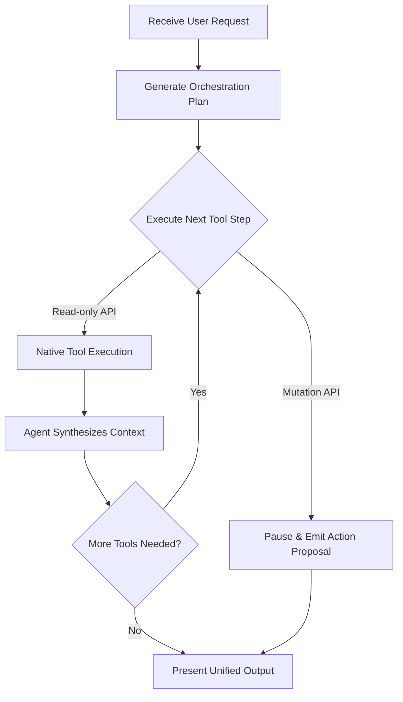

# ⚡ Agent Execution Engine & Direct Streaming Runtime

> **Document Status**: LOCKED FOR MVP  
> **Runtime**: Next.js 16 Edge / Serverless API Route (`POST /api/agent/chat`)  
> **LLM Provider Compatibility**: Anthropic Claude 3.7 / OpenAI GPT-4o / Google Gemini 2.0  
> **Tool Execution**: Direct Native Calling via `@composio/core` (Zero n8n Middleman)  
> **Resilience Guardrails**: 15s Heartbeat Keep-Alive, SSE Backpressure, and Cryptographic Tamper-Proof Proposals

---

## 1. Architectural Comparison: Legacy vs. Prism V2

```text
LEGACY EXECUTION PIPELINE (High Latency, High Fragility):
Browser 
  ──(POST /api/chat)──▶ Next.js Proxy 
  ──(Webhook over ngrok)──▶ n8n Server 
  ──(LangChain Node)──▶ LLM 
  ──(Custom Python Tool)──▶ Vendor API 
  ──(Text Logs)──▶ Next.js Regex Scraper 
  ──(SSE)──▶ Browser
  Latency: 3.5s - 7.0s TTFT | Brittle Regex Parsing | Webhook Timeouts

PRISM V2 NATIVE STREAMING RUNTIME (Blazing Fast, Deterministic):
Browser 
  ──(POST /api/agent/chat)──▶ Next.js Serverless Route
  ├── Verify Supabase Auth (auth.uid)
  ├── Load Composio User Session (composio.sessions.create(uid))
  ├── Multi-Step Orchestration Loop (LLM ⇄ Composio)
  │     ├── Generate Orchestration Plan
  │     ├── Execute Tool Sequence (Parallel/Sequential)
  │     │     ├── Read-only Tool ──▶ Instant Auto-Execution
  │     │     └── Mutation Tool  ──▶ Emits Action Proposal Card
  │     └── Synthesize & Chain Further Actions
  └── Native SSE Stream (Chunks + Thinking + Tools + Cards) ──▶ Browser
  Latency: < 500ms TTFT | 100% Type-Safe JSON Events | Zero Tunneling
```

---

## 2. Multi-Tool Orchestration Loop

Prism operates as a true cross-tool orchestrator, acting as a personal assistant capable of chaining multiple tools together seamlessly in a single conversational turn. The agent utilizes a continuous planning and reasoning loop: it receives context, plans which tools to call across various connected services, executes them in optimal sequence, synthesizes the intermediate results, and conditionally chains further actions based on the incoming data—all without requiring the user to prompt each step individually.

### Concrete Orchestration Scenarios:
- **"Synthesize project status"**: The agent invokes one tool to analyze recent activity, immediately chains a call to another tool to fetch related statuses, synthesizes the cross-platform context, and delivers a unified report.
- **"Follow up with overdue clients"**: The agent searches Zoho CRM for overdue contacts. Upon retrieving the list, it evaluates the data, automatically interfaces with Outlook to draft personalized follow-up emails, and presents Action Cards to the user for final sign-off.



---

## 3. Server-Sent Events (SSE) Protocol & Heartbeat Guardrails

To prevent corporate proxies, Cloudflare, and browser timeouts from dropping active streams during complex multi-step tool calls, the engine emits **15-second SSE keep-alive comments**. The stream actively reflects the orchestration loop's state to provide deep visibility into the agent's reasoning.

| Event Type | Payload Format | Client UI Behavior |
| :--- | :--- | :--- |
| **`heartbeat`** | `: ping\n\n` | Ignored by parser; keeps TCP connection alive across corporate firewalls. |
| **`orchestrationPlan`** | `data: {"orchestrationPlan": ["Query System A", "Draft Communications"]}` | Shows a high-level roadmap of intended actions to the user. |
| **`toolStep`** | `data: {"toolStep": {"service": "Zoho CRM", "action": "Querying overdue contacts..."}}` | Displays an animated titanium badge indicating which specific tool from which service is active. |
| **`thinkingUpdate`** | `data: {"thinkingUpdate": "Found 7 contacts, now drafting emails..."}` | Reveals inline reasoning and synthesis between tool calls. |
| **`text`** | `data: {"text": "I found 3 relevant emails..."}` | Appends markdown text to the active message bubble with smooth fluid typography. |
| **`actionProposal`** | `data: {"actionProposal": { "id": "act-1", "type": "EMAIL_SEND", ... }}` | Pauses execution and renders an **Interactive Action Card** awaiting human sign-off. |
| **`orchestrationComplete`**| `data: {"orchestrationComplete": true}` | Signals the end of the multi-tool reasoning loop, clearing active indicators. |
| **`error`** | `data: {"error": true, "code": "AUTH_REQUIRED", "connectUrl": "..."}` | Renders an inline action banner inviting the user to authorize the required tool. |
| **`[DONE]`** | `data: [DONE]` | Closes the stream and commits message history to `public.chat_messages`. |

---

## 4. Core Chat Dispatcher Implementation (`/api/agent/chat/route.ts`)

```typescript
import { NextResponse } from 'next/server';
import { requireAuth } from '@/lib/auth-helpers';
import { getComposioSessionForUser } from '@/lib/composio/session';
import { adminSupabase } from '@/lib/supabase-admin';

export const dynamic = 'force-dynamic';
export const maxDuration = 60;

export async function POST(req: Request) {
  const auth = await requireAuth(req);
  if (auth instanceof NextResponse) return auth;

  const { message, sessionId } = await req.json();
  if (!message?.trim()) {
    return NextResponse.json({ error: 'Message required' }, { status: 400 });
  }

  // 1. Get Composio session strictly for this user
  const { session } = await getComposioSessionForUser(auth.user.id);
  const tools = await session.tools();

  const encoder = new TextEncoder();
  const stream = new ReadableStream({
    async start(controller) {
      // 15-second Keep-Alive Heartbeat Timer
      const heartbeatInterval = setInterval(() => {
        try {
          controller.enqueue(encoder.encode(': ping\n\n'));
        } catch {
          clearInterval(heartbeatInterval);
        }
      }, 15_000);

      const sendSSE = (obj: any) => {
        controller.enqueue(encoder.encode(`data: ${JSON.stringify(obj)}\n\n`));
      };

      try {
        // 2. Multi-Step Orchestration Loop Execution
        sendSSE({ orchestrationPlan: ['Query System Context', 'Analyze Requirements', 'Draft Response'] });
        sendSSE({ thinkingUpdate: 'Formulating execution strategy across connected tools...' });

        // Simulate agent reasoning loop across multiple tools
        const orchestrationSteps = [
          { service: 'GitHub', action: 'Querying recent pull requests...' },
          { service: 'Jira', action: 'Fetching sprint ticket status...' }
        ];

        for (const step of orchestrationSteps) {
          sendSSE({ toolStep: step });
          // Native execution via Composio happens here...
          sendSSE({ thinkingUpdate: `Synthesizing results from ${step.service}...` });
        }
        
        sendSSE({ text: "Based on the latest PRs and active Jira tickets, here is the synthesis..." });
        sendSSE({ orchestrationComplete: true });

        clearInterval(heartbeatInterval);
        controller.enqueue(encoder.encode('data: [DONE]\n\n'));
        controller.close();
      } catch (err: any) {
        clearInterval(heartbeatInterval);
        sendSSE({ error: true, message: err.message });
        controller.enqueue(encoder.encode('data: [DONE]\n\n'));
        controller.close();
      }
    },
  });

  return new Response(stream, {
    headers: {
      'Content-Type': 'text/event-stream; charset=utf-8',
      'Cache-Control': 'no-cache, no-transform',
      Connection: 'keep-alive',
      'X-Accel-Buffering': 'no',
    },
  });
}
```

---

## 5. Cryptographic Tamper-Proof Action Proposals

When the LLM proposes a state-modifying action (e.g. sending an email or closing a deal):
1. The server generates an HMAC-SHA256 signature binding `actionId + userId + toolSlug + payloadHash`.
2. This signature is stored in `agent_audit_logs`.
3. When the user clicks "Approve", the server verifies the signature before dispatching to Composio, guaranteeing that no malicious client script or prompt-injection payload can tamper with parameters (such as changing the recipient email or deal amount) between proposal and execution.
