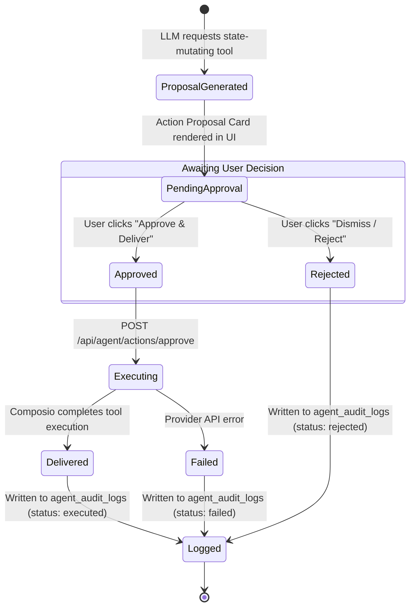

# 🛡️ Human-in-the-Loop Sign-Off & Action Approvals

> **Document Status**: LOCKED FOR MVP  
> **Security Model**: Principle of Least Privilege + Explicit Human Authorization  
> **Auditability**: 100% Immutable Ledger in `public.agent_audit_logs`

---

## 1. The Two-Tier Tool Security Model

To prevent accidental data modification, unintended communications, or destructive changes, tools are classified into two strict tiers:

```
TIER 1: READ-ONLY (Autonomous Execution)
  - Searching Outlook Emails / Teams Messages
  - Reading CRM Contacts / Deals / Tasks
  - Fetching Calendar Openings / GitHub PRs
  ──▶ Executed instantly by the Agent; results returned immediately.

TIER 2: STATE-MODIFYING (Human Approval Mandatory)
  - Sending Emails or Teams Messages
  - Updating Deal Stages, Creating Invoices, or Deleting Records
  - Provisioning SharePoint Sites or Merging Pull Requests
  ──▶ Agent generates an Action Proposal Card and HALTS execution.
  ──▶ Requires the user to click "Approve" before external execution.
```

---

## 2. The Approval Lifecycle



---

## 3. Action Approval Endpoint (`/api/agent/actions/approve/route.ts`)

```typescript
import { NextResponse } from 'next/server';
import { requireAuth } from '@/lib/auth-helpers';
import { adminSupabase } from '@/lib/supabase-admin';
import { getComposioSessionForUser } from '@/lib/composio/session'; // see docs/01-architecture/INTEGRATIONS_AND_COMPOSIO.md §2 — canonical helper

export async function POST(req: Request) {
  const auth = await requireAuth(req);
  if (auth instanceof NextResponse) return auth;

  const { actionId } = await req.json();
  if (!actionId) return NextResponse.json({ error: 'Action ID required' }, { status: 400 });

  // 1. Fetch pending audit log entry
  const { data: action, error } = await adminSupabase
    .from('agent_audit_logs')
    .select('*')
    .eq('id', actionId)
    .eq('user_id', auth.user.id)
    .eq('status', 'pending')
    .single();

  if (error || !action) {
    return NextResponse.json({ error: 'Action not found or already processed' }, { status: 404 });
  }

  // 2. Execute via Composio Platform Session
  try {
    const { session } = await getComposioSessionForUser(auth.user.id);
    const result = await session.execute(action.tool_slug, action.request_payload);

    // 3. Mark as executed in audit logs
    await adminSupabase
      .from('agent_audit_logs')
      .update({
        status: 'executed',
        execution_result: result,
        approved_by: auth.user.id,
        approved_at: new Date().toISOString(),
      })
      .eq('id', actionId);

    return NextResponse.json({ success: true, result });
  } catch (err: any) {
    await adminSupabase
      .from('agent_audit_logs')
      .update({ status: 'failed', execution_result: { error: err.message } })
      .eq('id', actionId);

    return NextResponse.json({ error: err.message }, { status: 500 });
  }
}
```
