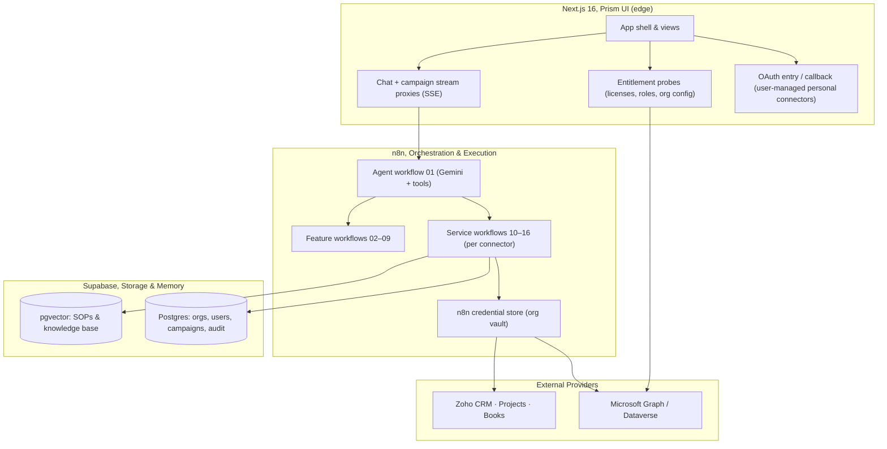

# 🔷 PRISM, One Interface, Every System
### *Unified Productivity Copilot, Product, Merge & Architecture Master Plan*

| | |
| :--- | :--- |
| **Status** | Approved, **Phases 0–1 complete**; **Phase 2 workflows authored** (01, 02, 09–16, pending n8n import); **Phase 3 shell live** (Prism tokens, logo/icon, 8-view sidebar); Phases 4–7 next |
| **Version** | 1.0 |
| **Brand** | Prism, "One interface, every system." |
| **Stack** | Next.js 16 (frontend) · n8n (orchestration/execution backend) · Supabase (Postgres + pgvector) · Google Gemini |
| **Merged from** | Project A, *Operations Cockpit* (Microsoft 365: Outlook, SharePoint/OneDrive, Dynamics 365 CRM) · Project B, *BCP Assist* (Zoho CRM, Zoho Projects, Zoho Books) |

---

## 📑 Table of Contents

1. [Executive Summary](#1-executive-summary)
2. [Product Vision & Positioning](#2-product-vision--positioning)
3. [Deep Audit of the Two Codebases](#3-deep-audit-of-the-two-codebases)
4. [Merge Strategy & Target Repository Layout](#4-merge-strategy--target-repository-layout)
5. [System Architecture (n8n-First)](#5-system-architecture-n8n-first)
6. [Connector Architecture](#6-connector-architecture)
7. [n8n Workflow Catalog (Brand-New)](#7-n8n-workflow-catalog-brand-new)
8. [UI/UX Design System](#8-uiux-design-system)
9. [Brand Kit, Prism](#9-brand-kit--prism)
10. [Productivity Feature Roadmap](#10-productivity-feature-roadmap)
11. [Phased Implementation Plan](#11-phased-implementation-plan)
12. [Risks & Guardrails](#12-risks--guardrails)
13. [Decisions Log & Open Questions](#13-decisions-log--open-questions)
14. [Ready-to-Copy Prompt for the n8n-MCP Agent](#14-ready-to-copy-prompt-for-the-n8n-mcp-agent)

---

## 1. Executive Summary

Prism merges two standalone copilot applications into **one unified productivity product**:

- **Project A (Operations Cockpit)** queries Microsoft **Outlook, SharePoint/OneDrive, and Dynamics 365 CRM** with direct Microsoft Graph calls and a cockpit-styled chat UI.
- **Project B (BCP Assist)** orchestrates **Zoho CRM, Zoho Projects, and Zoho Books** through an **n8n** agent (Gemini) with a porcelain light UI, campaign planning studio, and approval-gated writes.

The merged product keeps **n8n as the execution backend** (all connector data access and agent orchestration happen in n8n workflows built with the n8n workflow SDK), with Next.js as the presentation, authentication, and streaming-proxy layer, and Supabase as the multi-tenant data + vector store.

Three problems this product solves:

1. **The "No CRM Access" bug**, today, signing in with a Microsoft account reports CRM as broken for nearly everyone. Prism replaces the fixed three-pillar stack with a **connector model** in which a service is offered only when the user is genuinely entitled by the provider's own permission model, shared by their organization (for org connectors), and enabled by the user. No misleading errors, no fake toggles.
2. **Non-admin / individual users are locked out**, standard employees (no Dynamics license, no IT admin) and personal users get full **Outlook + OneDrive + Calendar** value with minimal-scope OAuth that needs no admin consent, while CRM-class connectors remain gated by real provider permissions.
3. **Two separate products, one account**, a single brand, one login, one chat, one place where Microsoft and Zoho data meet (e.g., an email from a client auto-attached to their deal in either CRM).

---

## 2. Product Vision & Positioning

> **Prism** is an AI productivity copilot that connects every system you work in, email, calendar, documents, CRM, projects, and books, and turns them into one conversation.

A prism takes many invisible light sources and refracts them into a single visible spectrum. Prism takes the many systems an organization and its people already use and refracts them into one coherent, queryable, actionable interface.

**Positioning by audience:**

| Audience | What they get | Connector tier |
| :--- | :--- | :--- |
| **Individuals** | Personal Outlook/OneDrive copilot, email Q&A, file analysis, CSV/PDF intelligence, todo extraction. No IT setup. | Personal (user-managed) |
| **Employees (non-admin)** | Their own mailbox + documents + whatever the org shares (Zoho suite, tenant SharePoint). No admin rights required for personal value. | Personal + org-shared |
| **Managers & Sales** | Deal radar, client 360, cashflow copilot, meeting copilot, cross-source search. | Org connectors |
| **Ops & Finance** | Campaign/project copilot with approval gates, risk scanner, invoice/dunning automation, daily briefings. | Org connectors (Zoho + Dynamics) |
| **Org Admins** | Connector hub, entitlements, RBAC, audit logs, usage analytics, IT-consent helper. | Admin console |

**Differentiators:** permission-honest connectors (never pretend to have access it doesn't), cross-vendor correlation (Microsoft × Zoho), and human-in-the-loop write governance.

---

## 3. Deep Audit of the Two Codebases

### 3.1 Project A, Operations Cockpit (Microsoft 365)

| Area | Finding |
| :--- | :--- |
| **Stack** | Next.js 16 App Router, React 19, Framer Motion, Tailwind v4, react-markdown. No Supabase client in the frontend (server routes only read cookies). |
| **Auth** | Direct Microsoft OAuth via `/api/integrations/microsoft/connect` → `/api/integrations/microsoft/callback`; tokens stored in httpOnly cookies (`ms_access_token`, `ms_refresh_token`, `ms_token_expires_at`, `ms_user_email`, `ms_user_name`). |
| **Graph access** | `src/lib/microsoft-graph.ts`, `fetchUserEmails` (`/me/messages`), `fetchUserDriveFiles` (`/me/drive/root/children`), `fetchUserProfile`, `refreshMicrosoftToken`. |
| **Chat** | `src/app/api/chat/route.ts`, keyword intent router (mail / files / crm / general) returning markdown tables; no LLM, no streaming. |
| **Tenant status** | `/api/tenant/status` returns service booleans; `/api/tenant/health` returns a permission report with an admin-consent URL. |
| **UI** | Single-page cockpit: header capsule, telemetry sidebar (3 endpoint cards), chat stream, hardware-style input bar, ⌘K shortcut, ambient background. Modals: `IntegrationsModal`, `AdminConsentModal`. |
| **Multi-tenant** | `database/migrations/01_multitenant_schema_and_rls.sql`, `operations_copilot` + `"BCP"` schemas, `organizations`, `organization_members`, `tenant_integrations` (provider enum: `microsoft_365 | dynamics_365 | outlook | custom_db`), RLS enabled. Proxy/middleware architecture documented but not fully implemented. |

### 3.2 Project B, BCP Assist (Zoho Suite)

| Area | Finding |
| :--- | :--- |
| **Stack** | Next.js 16 App Router, React 19, Motion, Phosphor icons, `@supabase/supabase-js`, `@google/genai`. |
| **Backend** | n8n-first. `src/app/api/chat/route.ts` is a pure SSE stream proxy to a hosted n8n webhook. `src/app/api/campaigns/route.ts` (~3,000 lines) orchestrates campaign CRUD + Zoho writes via n8n webhooks (`approve_and_push_zoho`, `update_live_campaign`, `save_draft`, …). `src/app/api/ai/intent/route.ts` classifies chat intent (CHAT / PLAN_CREATE / PLAN_MODIFY / PLAN_APPROVE). |
| **n8n workflows** | `workflows/` contains 12 SDK-based workflow definitions: `01_campaign_brain_copilot.ts` (Gemini agent with 6 tools: KB vector store, Zoho CRM Leads/Accounts, Deals/Books/Projects subworkflows), `02_passive_task_extractor*.ts`, `03_daily_risk_nudge.ts`, `03_task_update_workflow.ts`, `04_smart_email_drafter.ts`, `05_zoho_crm_deals_service.ts`, `06_zoho_projects_service.ts`, `07_zoho_books_invoices_service.ts`, `08_bcp_update_zoho_resources.ts`, cleanup scripts. |
| **Credentials** | Zoho org credentials live in n8n's credential store (`newCredential('Zoho account')`); org IDs hardcoded in workflows (`60085935707` portal, `60085935698` Books org, `zoho.in` datacenter). |
| **UI** | Sidebar app: Copilot (streaming chat + thinking stepper + working-plan studio drawer + approval modal + Zoho Books contact drawer), Campaigns (table/detail wizard), Connections (static service cards), Users & Roles (static). Hardcoded demo user "Rohit Sharma" in the sidebar. Settings view exists but is not routed. |
| **Data** | Supabase `public.campaigns` with Zoho IDs (deal/project/invoice), `public.documents` for pgvector SOPs, `public.action_items`, `public.agent_audit_logs`. |

### 3.3 Root-Cause Analysis, "No CRM Access"

The "this project doesn't have access to CRM" symptom has **five concrete root causes**, all confirmed in code:

1. **Bundled Microsoft scopes**, `frontend/src/app/api/integrations/microsoft/connect/route.ts` requests `offline_access openid profile User.Read Mail.Read Sites.Read.All Files.Read.All` in one shot. Dynamics 365 Dataverse requires its own resource scope `https://<org>.crm.dynamics.com/user_impersonation`, which is **never requested**. CRM is therefore never granted, by design of the current OAuth flow.
2. **License-guess CRM detection**, `callback/route.ts` queries `/v1.0/me/licenseDetails` for Dynamics SKUs and **hard-excludes personal accounts** (`outlook|hotmail|live|msn|gmail|yahoo`). For standard employees the license query returns nothing → `hasCrm = false`. The UI then presents a broken state rather than hiding CRM.
3. **Hardcoded disconnect**, `frontend/src/app/api/tenant/status/route.ts` hardcodes `crmConnected: false, // CRM requires separate Dataverse connection` on every status poll, resetting any client-side CRM state.
4. **Monolithic UI expectations**, `frontend/src/lib/constants.ts` (welcome message, `REQUIRED_ENTRA_SCOPES`, quick actions) and `TelemetrySidebar.tsx` always render all three pillars, so "Dynamics 365 CRM: Not Connected" is printed even for users who never had CRM.
5. **Rigid chat router**, `frontend/src/app/api/chat/route.ts` maps any query containing `deal|pipeline|opportunity|revenue|account|crm` to a CRM branch that outputs IT-admin-consent instructions, and the general branch always prints `Dynamics 365 CRM: Not Connected`.

### 3.4 Additional Issues Found

- **No connector granularity** on either side: Microsoft scopes are all-or-nothing; Zoho uses one shared org credential for everyone.
- **Fake/static UI in places** (BCP Connections cards, hardcoded user, Settings not routed), must become real before launch.
- **Hardcoded environment values** (Zoho org IDs, hosted n8n webhook URLs, default Azure client ID), must move to env/config.
- **No rate limiting, no audit trail on the Microsoft side**, no encrypted credential vault implementation despite docs claiming it.
- **Two design languages** (dark cockpit vs light porcelain), merged into one design system (Section 8).

---

## 4. Merge Strategy & Target Repository Layout

**Decision:** this repo (`Copilot`) becomes the single unified app. The `n8n` sibling repo remains the workflow source of truth for now; its artifacts are copied in during Phase 1.

### 4.1 Target layout

```text
Copilot/
├── docs/
│   ├── PRISM_PRODUCT_AND_MERGE_PLAN.md          # THIS master doc
│   ├── FUTURE_IMPLEMENTATIONS_AND_PRODUCTIVITY_PLAN.md
│   ├── ARCHITECTURE.md                          # to be rewritten for Prism
│   └── ...
├── workflows/                                   # n8n SDK definitions (ported + new)
│   ├── 01_prism_copilot.ts                      # new agent
│   ├── 02_intent_router.ts                      # new
│   ├── 03_daily_briefing.ts                     # new
│   ├── 04_deal_context_radar.ts                 # new
│   ├── 05_cross_source_search.ts                # new
│   ├── 06_meeting_copilot.ts                    # new
│   ├── 07_cashflow_copilot.ts                   # new
│   ├── 08_risk_scanner.ts                       # new
│   ├── 09_admin_consent_helper.ts               # new
│   ├── 10_ms_outlook_service.ts                 # new
│   ├── 11_ms_sharepoint_service.ts              # new
│   ├── 12_ms_dynamics_crm_service.ts            # new
│   ├── 13_zoho_crm_service.ts                   # ported from 05
│   ├── 14_zoho_projects_service.ts              # ported from 06
│   ├── 15_zoho_books_service.ts                 # ported from 07
│   ├── 16_knowledge_base_service.ts             # ported vector-store tool
│   └── legacy/                                  # 02–04, 08 + cleanups (archived or retired)
├── frontend/src/
│   ├── app/
│   │   ├── (marketing)/                         # optional landing (later)
│   │   ├── api/
│   │   │   ├── connectors/[provider]/[connector]/connect|callback|status|toggle
│   │   │   ├── chat/route.ts                    # SSE proxy (unified)
│   │   │   ├── campaigns/route.ts               # ported orchestrator
│   │   │   ├── ai/intent/route.ts               # ported
│   │   │   └── tenant/*                         # merged health/status
│   │   ├── layout.tsx  page.tsx  globals.css    # Prism shell
│   │   └── (views)/                             # home, copilot, inbox, documents,
│   │                                            # campaigns, connections, users, settings
│   ├── components/                              # ported + new (design system)
│   ├── hooks/                                   # useConnectors, useCopilotChat, useTenant…
│   ├── lib/
│   │   ├── connectors/registry.ts               # NEW connector registry + scope builders
│   │   ├── connectors/permissions.ts            # NEW entitlement logic
│   │   ├── supabase.ts                          # ported
│   │   ├── constants.ts  api-client.ts  utils.ts
│   ├── types/
│   └── proxy.ts
├── database/migrations/                         # extended schema (Phase 3/7)
├── docker-compose.yml                           # n8n + pgvector + qdrant (from n8n repo)
├── package.json  tsconfig.json  AGENTS.md  README.md
```

### 4.2 Unification decisions

| Concern | Decision |
| :--- | :--- |
| Package name | `prism` (rename in Phase 5 branding) |
| CSS framework | Tailwind v4 with a new Prism token layer (Section 8.2) |
| Icons | Phosphor icons (BCP style), broader set than lucide |
| Motion | `motion` (framer-motion v13 family) |
| Markdown rendering | react-markdown + GFM + raw (already shared) |
| Env vars | Unify into one `.env.example`: `AZURE_*`, `ZOHO_*` (client/data-center via config), `N8N_*` webhook URLs, `SUPABASE_*`, `GEMINI_*`. Hardcoded org IDs/URLs move to env. |
| Workspaces / tenants | Keep `organizations` + RLS; add `user_preferences` for per-user connector toggles (Phase 3). |

---

## 5. System Architecture (n8n-First)

### 5.1 Layer diagram



### 5.2 Responsibilities

| Layer | Responsibilities |
| :--- | :--- |
| **Next.js** | Rendering & design system; connector registry UI state; OAuth **initiation + callback for user-managed personal connectors** (Outlook/OneDrive/Calendar); storing encrypted user tokens; entitlement probes (Graph `/me/licenseDetails`, Dataverse `WhoAmI`, org config); SSE streaming proxy to n8n; campaign/CRM CRUD orchestration (ported). |
| **n8n** | **All** provider data access via service workflows; the Gemini agent with tools; intent routing; feature workflows (briefing, radar, search, meeting, cashflow, risk); cron triggers; **org credential vault**; writes gated by approval frames. |
| **Supabase** | Multi-tenant Postgres (organizations, members, `tenant_integrations` vault rows, `user_preferences`, campaigns, `action_items`, `agent_audit_logs`); pgvector RAG for the knowledge base; RLS enforced on every table. |

### 5.3 Chat request flow (target)

```text
User message
  → Next.js /api/chat (SSE proxy)
      → n8n 02_intent_router (classify: CHAT | PLAN_* | CONNECTOR_*)
      → n8n 01_prism_copilot (Gemini agent, tools = service workflows 10–16)
          → each tool call carries { connectorEnabled, entitlement, tokens }
          → refused cleanly if disabled/not entitled
      → SSE frames: toolCall (friendly label) → text chunks → [DONE]
  → Next.js renders stream with source badges + thinking stepper
```

---

## 6. Connector Architecture

### 6.1 Principles

1. **Offer, don't fake.** A connector is *offered* only when the user is entitled, the org shares it (org connectors), and the user enabled it.
2. **Follow provider permissions.** The app mirrors each platform's own permission model, Microsoft Entra license/role/consent semantics and Zoho org-account semantics. An employee in a Microsoft org **cannot** connect to Dynamics CRM unless they hold the license + Dataverse security role (+ admin consent where policy requires). Personal Microsoft accounts **cannot** be offered tenant-wide SharePoint or CRM.
3. **Scopes are per connector, never bundled.** Each connector requests exactly the scopes it needs. Nothing more.
4. **Toggles are real.** A toggle maps to (a) granted OAuth scopes stored in the vault, (b) a backend gate that refuses execution, and (c) UI state. Turning something off means the AI cannot call it.
5. **Graceful absence.** Not entitled / not shared / disabled states render cleanly (hidden card, "Paused", "Requires admin access" with a 1-click IT-request helper), never a scary consent error in the chat.

### 6.2 Connector registry spec

```typescript
// frontend/src/lib/connectors/registry.ts (target)
export type ConnectorTier = "personal" | "org";
export type ConnectorState =
  | { status: "not_entitled"; reason: string }            // provider says no
  | { status: "available" }                               // can connect
  | { status: "connected"; account?: string; scopes: string[]; tokenValid: boolean }
  | { status: "paused" }                                  // user toggle OFF
  | { status: "needs_reauth"; reason?: string };

export interface ConnectorDef {
  id: ConnectorId;                 // "outlook.mail" | "sharepoint" | "dynamics" | "zoho.crm" …
  provider: "microsoft" | "zoho" | "internal";
  tier: ConnectorTier;
  label: string;
  description: string;
  capabilities: string[];          // e.g. ["read:mail", "send:draft"]
  scopeBuilder: (ctx: ScopeCtx) => string[];   // per-connector scopes
  entitlementCheck: (ctx: EntitlementCtx) => Promise<EntitlementResult>;
  healthProbe: (ctx: ConnectorCtx) => Promise<ProbeResult>;
}
```

### 6.3 Connector catalog & permission matrix (v1)

| Connector | ID | Tier | OAuth scopes | Entitlement rule | Works for |
| :--- | :--- | :--- | :--- | :--- | :--- |
| **Outlook Mail** | `microsoft.outlook` | Personal | `openid profile email offline_access Mail.Read` | Any Microsoft account | Everyone |
| **Outlook Calendar** | `microsoft.calendar` | Personal | `Calendars.Read` (+ `offline_access`) | Any Microsoft account | Everyone |
| **OneDrive** | `microsoft.onedrive` | Personal | `Files.Read` (+ `offline_access`) | Any Microsoft account | Everyone |
| **SharePoint (tenant)** | `microsoft.sharepoint` | Org | `Sites.Read.All` | Org admin granted tenant consent **and** user has site access | Org members |
| **Dynamics 365 CRM** | `microsoft.dynamics` | Org | `https://<org>.crm.dynamics.com/user_impersonation` | User has Dynamics 365 license (SKU check) **and** Dataverse security role (`WhoAmI`/privilege probe) **and** admin consent if policy requires | Licensed CRM users only |
| **Zoho CRM** | `zoho.crm` | Org (or personal) | `ZohoCRM.modules.ALL` (n8n org credential) / user's own client | Org shared it; personal users can connect their own Zoho client | Org members / personal users |
| **Zoho Projects** | `zoho.projects` | Org | `ZohoProjects.projects.ALL` | Same | Org members |
| **Zoho Books** | `zoho.books` | Org | `ZohoBooks.fullaccess.ALL` | Same | Org members |
| **Knowledge Base** | `internal.kb` | Org | Supabase service role | Org membership | Org members |

**Future connectors** (registry makes these one-config additions): HubSpot, Salesforce, Google Workspace (Gmail/Drive/Calendar), Slack, Notion.

### 6.4 OAuth flows

**User-managed (personal tier):** Next.js `/api/connectors/microsoft/outlook/connect` builds a minimal-scope URL against `login.microsoftonline.com/common` (or tenant-specific for org later). Callback exchanges the code, stores the refresh token **encrypted per user** (Supabase `tenant_integrations` row with `user_id`, or httpOnly cookie for session-scoped personal mode), and returns `?connected=outlook`. Scope list shown on the consent screen is exactly what the card advertises.

**Org-managed (org tier):** admin connects once (Dynamics tenant consent flow + Dataverse app user, SharePoint admin consent, or Zoho org OAuth stored as an n8n credential). Members inherit `orgShared: true`; each member's toggle controls *their own* usage of the shared connector. A member never re-authenticates.

**Entitlement probe flow** (`/api/connectors/status`):
- Microsoft: `/me` (identity) → `/me/licenseDetails` (Dynamics SKU present?) → if work account: Dataverse `WhoAmI` (role present?) → per connector `{ entitled, reason }`.
- Zoho: org config lookup (`tenant_integrations` row for `zoho` + org) → `{ orgShared, providerHealth }`.
- Merge with the user's persisted toggles → final per-connector state returned to the UI.

### 6.5 Backend enforcement

- **Next.js chat proxy** passes `activeConnectors: { [id]: boolean }` plus tokens into the n8n payload.
- **Each n8n service workflow** begins with a gate node: if `connectorEnabled === false` or `entitlement === false` → return `{ refused: true, reason: "connector_disabled" | "not_entitled" }` without calling the provider. The agent is instructed to relay that cleanly ("CRM is turned off for you, toggle it in Connections", or "Dynamics CRM requires a license your account doesn't have, ask your admin").
- **Write operations** additionally require an approval frame (ported `ZohoApprovalModal` pattern) and are audit-logged.

### 6.6 Connector UI (Connections view)

- **Two sections**: "Your personal connections" and "Organization connections" (badged `Shared by <org>`).
- **Card anatomy**: provider logo, connector name + capability chips, status pill (`Active` / `Paused` / `Needs re-auth` / `Requires admin`), toggle switch, connected account + granted scopes (expandable), health probe timestamp, overflow menu (Reconnect / Disconnect / View permissions).
- **Add flow**: "Add connector" → provider picker → OAuth popup → returning card shows granted scopes → active.
- **Not-entitled handling**: `not_entitled` cards are hidden by default; when visible (e.g., Dynamics), show a locked card: "Requires a Dynamics 365 license and CRM role. Request access from IT." with a 1-click pre-drafted request email / admin-consent URL (workflow 09).
- **Persistence**: per-user toggles → Supabase `user_preferences` (RLS on user_id) with sessionStorage fallback; org sharing → `tenant_integrations`.

### 6.7 Permission-following rules (Microsoft vs Zoho)

| Provider model | Prism behavior |
| :--- | :--- |
| **Microsoft Entra**, licenses, roles, admin-consent gates | Personal accounts → personal tier only. Work accounts → personal tier automatically; org tier only after admin consent + license/role probe. Dynamics shown only to licensed + role'd users. |
| **Zoho**, org-owned API accounts / n8n credentials | Zoho connectors are org-managed by default (n8n credential). Personal Zoho accounts can attach their own client for personal use. Org members see Zoho cards only when the org has shared them. |
| **No admin access** | Personal connectors still work fully, this is the non-admin employee story. CRM-class cards show the locked state with the IT-request helper instead of breaking. |

---

## 7. n8n Workflow Catalog (Brand-New)

All workflows follow the existing SDK pattern (`trigger → parse scope → ifElse scoped → HTTP/credential call → format`), use `newCredential(...)` for org credentials, `options: { neverError: true }`, and gate on `connectorEnabled`/`entitlement` input fields.

### 7.1 Service workflows (data access)

| # | File | Purpose | Provider calls |
| :--- | :--- | :--- | :--- |
| 10 | `10_ms_outlook_service.ts` | List/search mail, fetch thread, send draft | `GET /me/messages`, `POST /me/sendMail` (draft) |
| 11 | `11_ms_sharepoint_service.ts` | List/search OneDrive + SharePoint sites/libraries | `GET /me/drive/root/children`, `GET /sites/{id}/drive/root/children` |
| 12 | `12_ms_dynamics_crm_service.ts` | Deals/accounts/contacts, scoped by dealId | Dataverse `GET {org}/api/data/v9.2/…` with `user_impersonation` |
| 13 | `13_zoho_crm_service.ts` | Leads/deals/accounts (port of `05`) + `connectorEnabled` gate | `zohoapis.in/crm/v2/…` |
| 14 | `14_zoho_projects_service.ts` | Projects/tasks/milestones (port of `06`) + gate | `projectsapi.zoho.in/api/v3/…` |
| 15 | `15_zoho_books_service.ts` | Invoices/estimates/customers (port of `07`) + gate | `zohoapis.in/books/v3/…` |
| 16 | `16_knowledge_base_service.ts` | pgvector RAG retrieval | Supabase `match_documents` |

### 7.2 Agent & feature workflows

| # | File | Purpose |
| :--- | :--- | :--- |
| 01 | `01_prism_copilot.ts` | Main Gemini agent; tools = service workflows 10–16; system prompt enforces connector gating and zero invented data |
| 02 | `02_intent_router.ts` | Classify query → `CHAT / CONNECTOR_<id> / PLAN_CREATE / PLAN_MODIFY / PLAN_APPROVE / BRIEFING / SEARCH …` |
| 03 | `03_daily_briefing.ts` | Calendar + urgent mail + open deals + overdue invoices + tasks → one digest (cron + on-demand) |
| 04 | `04_deal_context_radar.ts` | Incoming mail → match CRM record (Dynamics or Zoho) + project + invoices |
| 05 | `05_cross_source_search.ts` | One query across mail, files, CRM, tasks, KB with source tags |
| 06 | `06_meeting_copilot.ts` | Pre-brief, live action items, post-minutes → CRM/Projects + follow-up email |
| 07 | `07_cashflow_copilot.ts` | Overdue invoices, revenue-by-stage, dunning drafts |
| 08 | `08_risk_scanner.ts` | Port of daily risk nudge (72h UAT, budget burn), generalized to any metric |
| 09 | `09_admin_consent_helper.ts` | Org MS admin-consent URL generation + entitlement probe aggregation |

### 7.3 Workflow conventions

- Scope binding via `workflowInputs` (campaign/entity context) exactly like `05–07`.
- Output shape: `{ refused?, scoped, exists, records[], error? }`, clean JSON the frontend renders without parsing prose.
- Org IDs, datacenters, webhook URLs come from env (no hardcoding).
- Every service workflow is idempotent and read-mostly; writes only via approval-gated feature workflows.

---

## 8. UI/UX Design System

### 8.1 Design principles

1. **Calm clarity**, porcelain surfaces, hairline borders, soft shadows; content breathes.
2. **Connector-first**, every data source is a first-class, branded object with a clear state.
3. **One conversation**, chat remains the primary interface, with data surfaced as rich cards, tables, and source badges.
4. **Keyboard-fast**, ⌘K command palette, slash shortcuts, focus rings everywhere.
5. **Honest states**, loading/error/empty/not-entitled states are designed, not afterthoughts.

### 8.2 Tokens

| Token | Value |
| :--- | :--- |
| Background | `#FAFAF9` (porcelain) · surfaces `#FFFFFF` |
| Text | `#1C1917` (stone-900) / `#78716C` (stone-500) |
| Brand gradient | violet `#7C3AED` → cyan `#06B6D4` |
| Provider colors | Microsoft `#0078D4` · Zoho `#10B981` · Dynamics `#0F6CBD` · internal KB `#7C3AED` |
| Semantic | success `#10B981` · warn `#F59E0B` · danger `#EF4444` |
| Radius | `rounded-2xl` surfaces, `rounded-xl` controls, `rounded-full` pills |
| Shadow | layered soft: `shadow-xs` → `shadow-lg` at low opacity |
| Type | Inter (UI) + system fallbacks; mono (`ui-monospace`) for IDs/telemetry; display sizes tight-tracked |
| Motion | 150–300ms ease `[0.16, 1, 0.3, 1]`; view transitions, toggle springs, stepper pulses |

### 8.3 App shell & information architecture

Persistent collapsible sidebar (evolves BCP Assist shell) with the following views:

| # | View | Content |
| :--- | :--- | :--- |
| 1 | **Home** | Daily briefing card, connected-connector summary strip, quick actions, risk/alerts feed |
| 2 | **Copilot** | Unified chat: thinking stepper + elapsed timer, source badges, SOW-style cards, voice input, markdown export, plan-studio drawer |
| 3 | **Inbox** | Outlook-centric: triage (urgent/VIP), thread summaries, drafts (approval-gated send) |
| 4 | **Documents** | Cross-source explorer: SharePoint + OneDrive + uploads; search with RAG answers + citations |
| 5 | **Campaigns** | Ported: campaign table → detail wizard → 4-aspect plan studio → approval → Zoho sync status |
| 6 | **Connections** | The connector hub (Section 6.6), personal vs org sections, add flow, toggles, health |
| 7 | **Users & Roles** | Ported + real: members, roles, per-user connector entitlements, audit views (admin) |
| 8 | **Settings** | Workspace, guardrails/compliance gates, webhooks & env status, appearance |

**Dynamic context**: the Copilot welcome message, Home quick actions, and empty states render only enabled + entitled connectors. If no connectors: a friendly setup walkthrough leading to Connections.

### 8.4 Key screens (spec-level)

- **Login**: identifier-first, email input → route to personal (password/magic link/social/MS personal) or org (SSO/Entra). Post-login workspace selector.
- **Connections**: two-tier grid; empty state = "Connect your first system"; add-connector modal = provider logos grid.
- **Copilot with a working plan**: right-side studio drawer (ported) showing aspect tabs, task cards, SPOC chips, TAT/urgency, approval button; left chat is the executive summary (per BCP system prompt rule).
- **Home briefing**: morning card stacking calendar, urgent mail, open deals, overdue invoices, at-risk tasks with drill-down links.

### 8.5 Motion & interaction

- View transitions via `AnimatePresence mode="wait"`; layout animations for sidebar active state; toggle switches animate knob + status glow; telemetry pulse only for *live* health; reduced-motion respected (`prefers-reduced-motion`).

### 8.6 Accessibility

- WCAG AA contrast on porcelain; visible focus rings; semantic landmarks; keyboard navigable chat + tables; `aria-live` for stream updates; labels on every toggle with expanded state text (e.g., "Outlook Mail, Active. Grants read access to your mailbox.").

---

## 9. Brand Kit, Prism

### 9.1 Name rationale

A **prism** takes many invisible light sources and refracts them into one visible spectrum. Prism does the same for work systems: Outlook, SharePoint, Dynamics 365, Zoho CRM, Zoho Projects, Zoho Books, many sources, one coherent interface. Short, distinctive, evocative, and works equally for individuals and enterprises. It also reads as a verb-friendly noun ("prism it", "my prism"). 

### 9.2 Logo concept

A triangular prism mark: a light beam enters a triangle from the left and refracts out to the right into a violet→cyan spectrum that curls into a chat node (a rounded square with a tail). Alternative simplification: three converging lines (the "P" formed by prism edges) with a gradient dot at the focal point.

- **Primary lockup**: PrismLogo (SVG component `PrismLogo.tsx`) + "Prism" wordmark (semibold, tight tracking) + optional tagline "One interface, every system."
- **Deliverables**: `frontend/src/components/brand/PrismLogo.tsx`, favicon set (16/32/apple-touch + SVG), OG image, empty-state illustration system, error-state illustration system.

### 9.3 Color palette

| Role | Token |
| :--- | :--- |
| Brand 1 (violet) | `#7C3AED` |
| Brand 2 (cyan) | `#06B6D4` |
| Gradient | `linear-gradient(135deg, #7C3AED, #06B6D4)` |
| Ink | `#1C1917` |
| Paper | `#FAFAF9` / `#FFFFFF` |
| Provider accents | Microsoft `#0078D4` · Zoho `#10B981` · Dynamics `#0F6CBD` · KB `#7C3AED` |

### 9.4 Typography

- **UI**: Inter (400/500/600/700), `-0.02em` tight display tracking, 13–15px base.
- **Mono**: `ui-monospace, SFMono-Regular, Menlo` for IDs, scopes, telemetry, timestamps.

### 9.5 Voice & tone

- Direct, calm, helpful. Explain permissions in one sentence, never with jargon or scare text ("requires admin consent" → "ask your IT admin to unlock this once").
- Data claims always cite the live source; zero invented numbers. When a tool returns nothing, say so plainly.

### 9.6 Brand implementation checklist (Phase 3/5)

- [ ] `layout.tsx` metadata (`title: "Prism"`, description, OG, theme-color)
- [ ] `PrismLogo.tsx` + favicon set + manifest
- [ ] Header/sidebar lockups; README + package.json rename
- [ ] Empty/error illustration system; auth screens rebranded

---

## 10. Productivity Feature Roadmap

### 10.1 Data asset map

| Asset | Source connectors |
| :--- | :--- |
| Email & calendar | Outlook Mail, Outlook Calendar |
| Documents | OneDrive, SharePoint, uploads |
| Microsoft CRM | Dynamics 365 (deals, accounts, contacts, activities) |
| Zoho CRM | Deals, leads, accounts, tasks |
| Project execution | Zoho Projects (projects, milestones, tasks) |
| Finance | Zoho Books (invoices, estimates, payments, TDS) |
| Knowledge | Supabase pgvector (SOPs, case studies, uploads) |

### 10.2 Feature catalog

**F1, Unified Daily Briefing** *(workflow 03)*
Before the day starts: calendar + urgent email + open deals (both CRMs) + overdue invoices + at-risk tasks in one digest. Query: *"What do I need to know today?"* / "Morning briefing."

**F2, Email Intelligence** *(workflow 10 + agent)*
Priority/VIP triage, 20-message thread → 3-bullet decision summary, tone-matched reply drafts that pull live data (deal stage, invoice balance), follow-up reminders, "find every email about X and link it to the deal."

**F3, Deal Context Radar** *(workflow 04)*
Incoming mail from a client auto-attaches: matching CRM record (Dynamics or Zoho), project status, invoices, related documents. Cross-references Microsoft ↔ Zoho, the merged-product superpower.

**F4, Client 360** *(features 03/04/05 composition)*
One account view uniting Dynamics deals, Zoho deals/tasks, invoices, email threads, and documents for a single client.

**F5, Document Intelligence** *(workflows 11, 16 + agent)*
RAG over SharePoint/OneDrive/uploads: "Compare the signed MSA with the new addendum", "Search SOPs", "Draft the QBR memo", slide-deck drafts with citations.

**F6, Campaign / Project Copilot** *(ported BCP 4-aspect planner, generalized)*
Any initiative → legal/compliance/accounting/implementation task plan with SPOCs, TATs, urgency; approval gate before any write; push to Zoho Projects/CRM; status sync back.

**F7, Cashflow Copilot** *(workflow 07)*
"Which invoices are 30+ days overdue?", revenue-by-stage across CRMs, dunning email drafts, TDS/escrow summaries.

**F8, Meeting Copilot** *(workflow 06)*
Pre-meeting brief (attendees, recent mail, docs, deals), live action-item capture, post-meeting minutes pushed to CRM + Projects + follow-up email.

**F9, Cross-Source Search** *(workflow 05)*
One query across mail, files, CRM records, tasks, KB with typed results and source badges.

**F10, Scheduled Digests & Alerts** *(workflows 03, 08)*
Daily/weekly digests; risk scanner (72h UAT rule, budget burn, generalized to any metric); alert channels (in-app, email, later Slack/Teams).

**F11, Personal Mode (no enterprise access)** *(workflows 10, 11 + uploads)*
Outlook/OneDrive-only operation: email Q&A, file analysis, todo extraction from mail, CSV/Excel/PDF drag-and-drop intelligence.

**F12, Org Admin Suite**
Usage analytics, connector health dashboard, entitlements explorer, RBAC, audit log viewer, IT-consent helper (workflow 09), (later) SCIM provisioning.

**F13, Governance & Audit**
Every AI write is approval-gated + audit-logged (`agent_audit_logs`); weekly "what changed in our pipeline/deals" report; zero-leak policy (secrets never enter the LLM context).

### 10.3 Persona × feature matrix

| Feature | Individual | Employee | Manager/Sales | Finance/Ops | Admin |
| :--- | :--- | :--- | :--- | :--- | :--- |
| F1 Briefing | ✅ | ✅ | ✅ | ✅ | ✅ |
| F2 Email Intel | ✅ | ✅ | ✅ | ✅ |, |
| F3 Deal Radar |, |, | ✅ | ✅ |, |
| F4 Client 360 |, |, | ✅ | ✅ |, |
| F5 Doc Intel | ✅ | ✅ | ✅ | ✅ |, |
| F6 Project Copilot |, | ✅ | ✅ | ✅ |, |
| F7 Cashflow |, |, | ✅ | ✅ |, |
| F8 Meeting | ✅ | ✅ | ✅ | ✅ |, |
| F9 Search | ✅ | ✅ | ✅ | ✅ |, |
| F10 Digests | ✅ | ✅ | ✅ | ✅ | ✅ |
| F11 Personal mode | ✅ | ✅ |, |, |, |
| F12 Admin suite |, |, |, |, | ✅ |
| F13 Governance |, |, |, | ✅ | ✅ |

---

## 11. Phased Implementation Plan

| Phase | Scope | Exit criteria |
| :--- | :--- | :--- |
| **0 (done)** | This master document + roadmap update + README note | Doc approved & committed |
| **1** | Repo consolidation: copy `workflows/`, Supabase lib, campaigns/chat/intent routes, key components into this repo; unified env/package.json | ✅ **Done**, `npm run build` + root/frontend `tsc --noEmit` pass; `/` = sidebar shell, `/cockpit` = legacy MS cockpit; unified `/api/chat` dispatches both payload contracts (live-tested: n8n SSE stream + Graph JSON) |
| **2** | n8n service workflows 10–16 + intent router 02; chat proxy wired to agent workflow 01 | ⏳ **Workflows authored & typechecked**: `01_prism_copilot`, `02_intent_router`, `09_admin_consent_helper`, `10–16` services, `_prism_workflow_ids` registry (see §14). **Remaining**: import into n8n, fill DB IDs in `workflows/_prism_workflow_ids.ts`, point `N8N_WEBHOOK_URL` at the Prism chat webhook. Feature workflows 03–08 ship with their Phase 6 features. |
| **3** | Design tokens + new app shell (8 views) + Prism branding + login flow | ✅ **Done (shell scope)**, `prism-*` tokens/utilities in `globals.css`; `PrismLogo` (tile+glyph) + `icon.svg`; `PrismSidebar` with 8 grouped views, collapse + mobile drawer; root `/` = Prism shell: Home (live cards + quick prompts), Copilot/Campaigns/Connections/Users/Settings ported, Inbox/Documents designed placeholders; metadata rebranded. Remaining: login/onboarding flow + deep rebrand of ported component copy (Phase 4–6). |
| **4** | Microsoft personal connectors (Outlook/OneDrive/Calendar, minimal scopes); entitlement engine (license + Dataverse role + org sharing); Connections UI with real toggles | Personal connectors work end-to-end; "no CRM access" bug gone; Dynamics appears only for entitled users |
| **5** | Zoho connectors (org credentials) + Campaigns port + approval gates | Zoho suite connectable from UI; campaign flow ported |
| **6** | Cross-source features F1–F9 (briefing, radar, search, documents, meeting, cashflow) | At least F1, F3, F9 demonstrable with live data |
| **7** | Hardening & scale: RLS audit, encrypted vault, Redis rate limiting, audit logs, deployment (Vercel + Supabase + hosted n8n), docs rewrite (`ARCHITECTURE.md`) | Security review pass; production deploy runbook |

---

## 12. Risks & Guardrails

| Risk | Mitigation |
| :--- | :--- |
| **Microsoft admin consent still gates `Sites.Read.All` / Dynamics** | Surfaced honestly: locked card + 1-click IT-request + consent workflow 09. Never a fake toggle. Personal value never blocked by org policy. |
| **Zoho org credentials in n8n; health ambiguity** | Health probes distinguish "token broken" (re-auth) from "API down" (circuit breaker) without leaking secrets; org IDs from env. |
| **Rate limits / noisy neighbor** | Per-tenant Redis sliding-window buckets; semantic caching of repetitive queries (5–15 min) to cut LLM cost up to ~85%. |
| **Cross-tenant data leak** | RLS forced on every table (`FORCE ROW LEVEL SECURITY`); n8n workflows receive scoped context only; AI writes restricted to approval-gated actions; audit logs on all writes. |
| **Partial outage** | Circuit breakers per connector; chat reports available sources with a clear disclaimer instead of failing. |
| **Hardcoded values / secrets** | All org IDs, webhook URLs, client IDs move to env; `.env.example` documented; zero-leak policy (no secrets in LLM context or commits). |
| **Employee offboarding** | Logout clears cookies/session; (Phase 7) SCIM + webhook de-provisioning + session revocation. |

---

## 13. Decisions Log & Open Questions

| # | Decision | Status |
| :--- | :--- | :--- |
| D1 | Merge target = this repo | ✅ Confirmed |
| D2 | Backend = n8n-first (workflows created with n8n skills) | ✅ Confirmed |
| D3 | Auth = hybrid, provider-permission-following | ✅ Confirmed |
| D4 | Brand = Prism | ✅ Confirmed |
| D5 | UI = fresh unified light SaaS | ✅ Confirmed |
| Q1 | Host n8n (self-hosted Docker vs cloud) for production? | Open, Phase 7 |
| Q2 | Zoho personal-tier OAuth: n8n-managed per-user credentials vs Next.js-managed? | Open, Phase 5 |
| Q3 | Publish as SaaS multi-tenant or single-tenant per org? | Open, Phase 7 |
| Q4 | Which feature ships first after connectors (F1 briefing vs F3 radar)? | Open, Phase 6 |

---

## 14. Ready-to-Copy Prompt for the n8n-MCP Agent

> You are building the n8n backend for **Prism**, a unified productivity copilot that merges a Microsoft 365 app (Outlook, SharePoint, Dynamics CRM) and a Zoho app (CRM, Projects, Books) into one product. Use the n8n workflow SDK (`@n8n/workflow-sdk`) and follow the existing pattern in `workflows/05_zoho_crm_deals_service.ts`, `06_zoho_projects_service.ts`, `07_zoho_books_invoices_service.ts` (trigger → parse scope → ifElse scoped → HTTP/credential call → format, with `newCredential('Zoho account')` and `neverError`).
>
> Create these **new** workflow files:
> 1. `10_ms_outlook_service.ts`, workflowInputs: `{ accessToken, connectorEnabled, scope: 'list' | 'search' | 'thread', query?, limit? }`; HTTP GET `https://graph.microsoft.com/v1.0/me/messages` with the injected Bearer token; refuse when `connectorEnabled` is false.
> 2. `11_ms_sharepoint_service.ts`, inputs `{ accessToken, connectorEnabled, scope: 'onedrive' | 'site', siteId?, query? }`; GET `/me/drive/root/children` or `/sites/{siteId}/drive/root/children`.
> 3. `12_ms_dynamics_crm_service.ts`, inputs `{ accessToken, crmOrgUrl, connectorEnabled, scope: 'deals' | 'account', dealId? }`; GET `${crmOrgUrl}/api/data/v9.2/...` with `user_impersonation` bearer; format like the Zoho service.
> 4. `13_zoho_crm_service.ts`, `14_zoho_projects_service.ts`, `15_zoho_books_service.ts`, port the existing `05/06/07` services, adding a `connectorEnabled` input gate and a `Zoho account` credential (keep org IDs configurable via env).
> 5. `16_knowledge_base_service.ts`, Supabase pgvector retrieval as a tool (port the existing vector store config).
> 6. `01_prism_copilot.ts`, Gemini agent with all service workflows as tools; system prompt: never call a connector whose `connectorEnabled`/`entitlement` is false; never invent records; when a tool returns 0 items say so explicitly.
> 7. `02_intent_router.ts`, `03_daily_briefing.ts`, `04_deal_context_radar.ts`, `05_cross_source_search.ts`, `06_meeting_copilot.ts`, `07_cashflow_copilot.ts`, `08_risk_scanner.ts`, `09_admin_consent_helper.ts` per the workflow catalog above.
>
> Keep every workflow scoped (never return cross-tenant data), use `options: { neverError: true }`, format outputs as clean JSON arrays the frontend can render, and add workflow IDs/meta consistent with the repo. Do not touch the Next.js frontend.