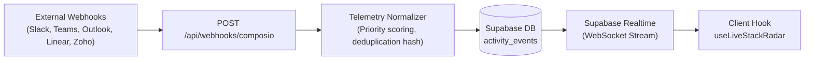
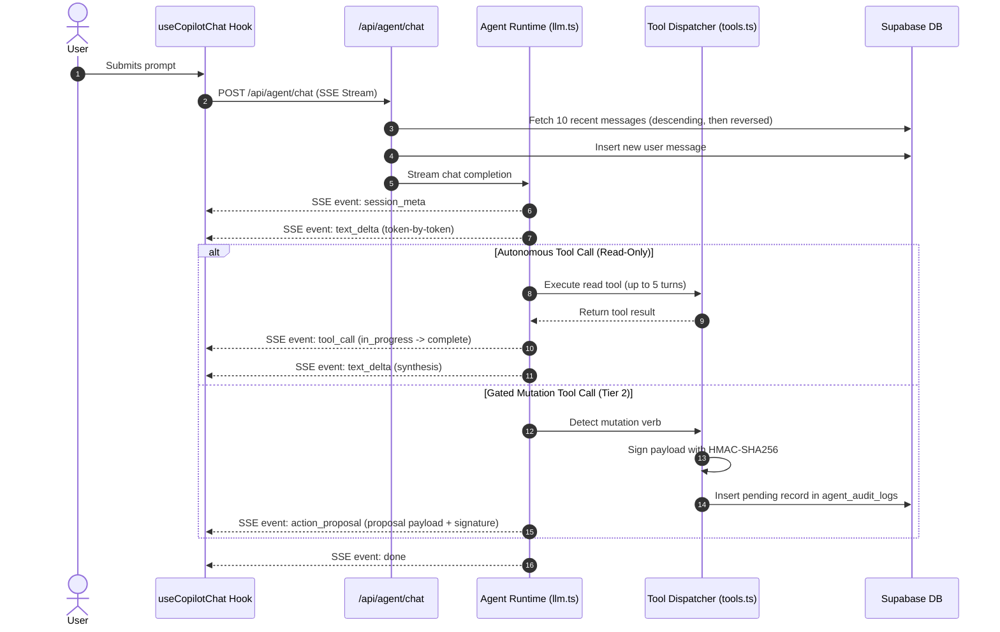

# 📋 Prism Copilot V2: Comprehensive Implementation & Architecture Report

> **Document Status**: Complete Implementation Report  
> **Repository**: `abhi-enlight/Copilot`  
> **Key Note on User Interface**: *As requested, the UI work is left for subsequent iterations. This report details all backend, architectural, database, agent runtime, security, and integration changes made to date, while clearly specifying the UI work that remains to be done.*

---

## 1. Executive Summary

The project has undergone a complete architectural modernization from a legacy, fragile BCP/n8n-mediated proxy stack into **Prism Copilot V2**: an enterprise-grade, serverless-direct agent platform. 

The core transformation centers on:
1. **Direct Agent Streaming Runtime (Zero n8n)**: Sub-second TTFT streaming via native Server-Sent Events (SSE) with multi-step tool chaining.
2. **Universal Tool Integration (Prism Connect Hub)**: Per-user isolated tool authentication via Composio, supporting 5 core platforms (Outlook, Microsoft Teams, Slack, Linear, and Zoho CRM) under 100% Prism brand sovereignty.
3. **Real-Time Live Stack Telemetry**: High-throughput webhook ingestion, priority scoring, deduplication, and Supabase Realtime WebSocket delivery for proactive alerts.
4. **Human-in-the-Loop (HITL) Security Ledger**: Two-tier tool execution (autonomous read vs. gated mutation), HMAC-SHA256 signed action proposals, atomic concurrency locks, and an immutable audit ledger.
5. **Radical Legacy Cleanup**: Deletion of ~11,000 lines of dead legacy workflows, proxy endpoints, mock services, and orphaned UI views.

---

## 2. Legacy Stack Deletion & Clean Architecture (Phase 0)

To eliminate architectural bloat and prevent conflicting runtime behaviors, the entire legacy BCP/n8n ecosystem was systematically pruned:

- **Deleted Legacy Workflow Trees (~11k lines across 130 files)**:
  - Removed `workflows/` directory including mock TypeScript services (`ms_outlook_service`, `zoho_crm_service`, `dynamics_crm_service`, `campaign_brain_copilot`, `task_extractor_v2`, etc.).
  - Removed all `workflows/n8n_instance_snapshot/*.json` workflow definitions.
  - Removed outdated BCP documentation and specifications from `tester_docs/` and root `docs/`.
- **Eliminated Dead Legacy API Endpoints**:
  - Removed `/api/chat` (legacy n8n proxy) and `/api/chat/debug`.
  - Removed `/api/ai/intent`, `/api/risk-digest`, `/api/campaigns`.
  - Removed legacy mail/sharepoint routes (`/api/mail/*`, `/api/sharepoint/site/create`).
  - Removed `/api/users`, `/api/auth/sso-lookup`, `/api/tenant/*`, `/api/organizations`.
  - Removed custom OAuth endpoints (`/api/integrations/microsoft/*`, `/api/integrations/zoho/*`, `/api/integrations/refresh-tokens`).
- **Removed Deprecated Legacy Frontend Views & Components**:
  - Pruned legacy views: `CopilotView`, `CampaignsView`, `ConnectionsView`, `SettingsView`, `UsersAndRolesView`, `views/*`, `cockpit/*`.
  - Pruned orphaned layout components: `PrismSidebar`, `Sidebar`, `ChatMessage`, `ChatInput`, `EmptyState`, `ThinkingProcess`, `modals/*`, `connectors/*`.
  - Removed legacy cards: `EmailDraftCard`, `SharePointSiteCard`, `IntegrationStatus`.
- **Removed Obsolete Utilities & Styling**:
  - Pruned dead helper libraries: `api-client.ts`, `campaign-planner.ts`, `copilot-storage.ts`, `connector-preferences.ts`, `entitlements.ts`, `microsoft-vault.ts`, `microsoft-graph.ts`, `zoho.ts`, `token-refresher.ts`.
  - Dropped unreferenced stylesheet `app/bcp-globals.css`.
- **Established Master V2 Specifications**:
  - Authored locked documentation hierarchy in `docs/` covering architecture, database, design system, telemetry, agent engine, and GitOps runbooks.

---

## 3. Database Schema Alignment & Security Hardening

Migration [`10_prism_v2_live_telemetry_and_audit.sql`](file:///Users/abhi/Desktop/Copilot/database/migrations/10_prism_v2_live_telemetry_and_audit.sql) introduced the foundational schema for V2 operations:

| Table / Object | Purpose | Security & Constraints |
| :--- | :--- | :--- |
| **`public.agent_audit_logs`** | Canonical Human-in-the-Loop audit ledger for all proposed, approved, rejected, executed, and failed actions. | • Status check: `CHECK (status IN ('pending', 'approved', 'rejected', 'executed', 'failed'))` • Two-tier RLS: Personal pending proposals are strictly private (`auth.uid() = user_id`); executed compliance logs are accessible to org owners/admins. • Indexed by `(user_id, created_at DESC)` and `(user_id, status) WHERE status = 'pending'`. |
| **`public.activity_events`** | Real-time cross-tool telemetry feed (Slack, Teams, Outlook, Linear, Zoho CRM). | • Deduplication unique index: `idx_activity_events_dedup(source, external_id)` • Priority check: `CHECK (priority IN ('low', 'normal', 'urgent', 'critical'))` • Enrolled in `supabase_realtime` publication with `REPLICA IDENTITY FULL`. |
| **`public.chat_messages`** | Chat history persistence supporting rich agent states. | • Expanded role check: `CHECK (role IN ('user', 'assistant', 'system', 'tool'))` • Added `action_proposals JSONB DEFAULT '[]'::jsonb`. |
| **`public.chat_sessions`** | Multi-session conversation management. | • Added `pinned BOOLEAN NOT NULL DEFAULT false`. |
| **`public.app_users`** | User profile extensions for identity mapping. | • Added `avatar_url TEXT` and `composio_entity_id TEXT`. |

---

## 4. Universal Tool Integration (Prism Connect Hub)

Prism V2 replaced vendor-specific token storage with an isolated, managed per-user integration engine:

### 4.1 Session Provider & Isolation ([`lib/composio/session.ts`](file:///Users/abhi/Desktop/Copilot/frontend/src/lib/composio/session.ts))
- **Per-User Entity Scoping**: Every user receives an isolated entity ID (`prism_user_${userId}`). No cross-tenant or cross-user token contamination can occur.
- **5 Core Tools Supported**:
  - `microsoft_outlook` (Mail & Calendar)
  - `microsoft_teams` (Channels & Messaging)
  - `slack` (Channels & Messages)
  - `linear` (Issues & Project Tracking)
  - `zoho_crm` (Leads, Deals, Accounts)
- **Brand Error Sanitization**: Wraps underlying errors and strips third-party vendor names to enforce 100% Prism brand sovereignty.

### 4.2 Integration API Routes
- **`GET /api/integrations/status`**: Queries live connected accounts for the authenticated user, formats connection states, and returns capability metadata.
- **`POST /api/integrations/connect`**: Initiates OAuth flows, generates white-labeled authorization URLs, and sets the redirect callback.
- **`POST /api/integrations/disconnect`**: Revokes and deletes connection sessions on demand.
- **`GET /integrations/callback`**: Landing page handling OAuth popup messaging via `window.opener.postMessage` for seamless in-app connection without page reloads.

---

## 5. Live Stack Telemetry Pipeline

The telemetry engine ingests external workspace events in real time to power ambient awareness and proactive notifications:

### 5.1 Telemetry Normalizer ([`lib/telemetry/normalizer.ts`](file:///Users/abhi/Desktop/Copilot/frontend/src/lib/telemetry/normalizer.ts))
- **Schema Harmonization**: Converts diverse provider webhooks into a unified payload format (`title`, `summary`, `source`, `event_type`, `priority`, `actionable`).
- **Priority Scoring Engine**: Automatically classifies severity into `low`, `normal`, `urgent`, or `critical` using regex rules (e.g., SLA breaches, P0/P1 incidents, urgent keywords).
- **Synthetic Deduplication Fallback**: Computes SHA-256 fallback hashes when providers omit external event IDs.
- **Payload Truncation Guard**: Caps raw JSON payload storage to prevent database bloat.

### 5.2 Endpoints & Subscription Hooks
- **`POST /api/webhooks/composio`**: Public webhook ingestion endpoint; exempted from authentication middleware while verifying incoming signatures.
- **`GET /api/telemetry/events`**: Returns high-watermark catchup feeds and handles batch mark-as-read status updates.
- **`useLiveStackRadar` Hook ([`hooks/useLiveStackRadar.ts`](file:///Users/abhi/Desktop/Copilot/frontend/src/hooks/useLiveStackRadar.ts))**: Subscribes to the Supabase Realtime channel, maintains unread badge counts, and handles optimistic read state transitions.

---

## 6. Direct Streaming Agent Engine (Zero n8n)

The core conversational engine was rebuilt from scratch to eliminate n8n middleware latency and achieve sub-second Time to First Token (TTFT):

### 6.1 Unified SSE Wire Protocol ([`types/chat.ts`](file:///Users/abhi/Desktop/Copilot/frontend/src/types/chat.ts))
Replaced fragmented legacy event models with a single canonical union contract:
- `session_meta`: Transmits `session_id`, `created_at`, and session parameters.
- `tool_call`: Broadcasts tool name, status (`in_progress` | `complete` | `failed`), input arguments, and execution output.
- `text_delta`: Streams raw token chunks as they arrive from the model.
- `action_proposal`: Emits signed Human-in-the-Loop proposals requiring explicit user approval.
- `error`: Transmits user-facing, sanitized error messages.
- `done`: Signals the graceful completion of the turn.

### 6.2 Agent Runtime & LLM Loop ([`lib/agent/llm.ts`](file:///Users/abhi/Desktop/Copilot/frontend/src/lib/agent/llm.ts))
- **Direct Model Streaming**: Direct HTTP streaming connection to Gemini 2.5 Flash / OpenAI-compatible models.
- **Sequential Multi-Tool Chaining**: Executes up to 5 iterative tool turns within a single conversation turn (e.g., read email -> query CRM deal -> cross-reference ticket -> stage draft).
- **Context Window Hardening**: Fixes historical ordering by querying the 10 most recent prior messages descending by `created_at`, then reversing them to chronological order before persisting the user message.

---

## 7. Security Architecture & Human-in-the-Loop (HITL)

A core pillar of Prism V2 is ensuring the agent cannot execute destructive or state-changing actions without explicit human confirmation:

### 7.1 Two-Tier Tool Security Model ([`lib/agent/tools.ts`](file:///Users/abhi/Desktop/Copilot/frontend/src/lib/agent/tools.ts))
- **Tier 1 (Autonomous Read-Only)**: Verbs such as `search`, `get`, `list`, `read`, `fetch`, `query`, `retrieve`, `preview`. The agent executes these immediately without human intervention to minimize friction.
- **Tier 2 (Gated Mutation / Sensitive)**: Verbs such as `send`, `create`, `update`, `delete`, `post`, `write`, `close`, `modify`, `approve`. The agent generates an `ActionProposal` and pauses execution.
- **Fail-Safe Default**: Any unrecognized tool slug defaults to **mutation** (Tier 2), preventing accidental execution of novel actions.

### 7.2 Cryptographic Signing & Tamper Proofing ([`lib/agent/crypto.ts`](file:///Users/abhi/Desktop/Copilot/frontend/src/lib/agent/crypto.ts))
- Every proposal is signed with an HMAC-SHA256 signature using `AGENT_SECRET_KEY`:
  $$\text{HMAC-SHA256}(userId + toolSlug + actionType + requestPayload + createdAt)$$
- **Constant-Time Verification**: Uses `crypto.timingSafeEqual` to eliminate timing attacks.
- **24-Hour Expiration**: Proposals older than 24 hours are rejected automatically.

### 7.3 Concurrency Protection & Loud Failure ([`api/agent/actions/approve/route.ts`](file:///Users/abhi/Desktop/Copilot/frontend/src/app/api/agent/actions/approve/route.ts))
- **Atomic Double-Click Lock**: SQL updates enforce `WHERE status = 'pending'`, ensuring concurrent or repeated clicks can only execute once.
- **Loud Error Handling**: If an approved tool execution fails at the provider layer, the audit log records `status = 'failed'` with the real error message and returns HTTP `502 execution_failed`. It **never** reports a false success.

---

## 8. Automated Test Probes & Verification

Four automated verification scripts were added to `scripts/` to validate the system end-to-end:

| Script | Coverage & Validation Items |
| :--- | :--- |
| [`scripts/verify-phase0-db.ts`](file:///Users/abhi/Desktop/Copilot/scripts/verify-phase0-db.ts) | Validates DB schema, column constraints, indexes, RLS policies, Realtime publication enrollment, and PostgREST client operations. |
| [`scripts/verify-phase1-integrations.ts`](file:///Users/abhi/Desktop/Copilot/scripts/verify-phase1-integrations.ts) | Tests Composio session provider, tool slug normalization, OAuth URL generation for all 5 core tools, IDOR ownership isolation, and brand error sanitization. |
| [`scripts/verify-phase2-telemetry.ts`](file:///Users/abhi/Desktop/Copilot/scripts/verify-phase2-telemetry.ts) | Tests telemetry normalizer, priority scoring heuristics, deduplication index idempotency, high-watermark queries, and Realtime replica identity. |
| [`scripts/verify-phase3-agent.ts`](file:///Users/abhi/Desktop/Copilot/scripts/verify-phase3-agent.ts) | Tests HMAC proposal signing and anti-tampering, two-tier tool classification, atomic double-click lock, approval/rejection state transitions, 24h expiration, and brand sovereignty. |

**Build Verification**: `next build` passes cleanly with **0 TypeScript errors** and **13 active production routes** compiled in under 1 second.

---

---

## 9. User Interface & Executive Design System (Completed)

> [!NOTE]
> **Status of User Interface**: The UI overhaul has been fully planned and implemented across all app surfaces adhering to the Apple-caliber executive command standard.

### 9.1 Implemented UI Components & Enhancements
- **Design System & Token Architecture ([`globals.css`](file:///Users/abhi/Desktop/Copilot/frontend/src/app/globals.css))**:
  - Warm stone & obsidian palette (`--bg-base: #FAFAF9`, `--bg-elevated`, `--bg-recessed`, `--bg-inverse`), Indigo accent (`#6366F1`), and 4-tier diffused shadow scale replacing harsh generic borders.
  - Geist typography scale with calibrated negative tracking on headings and generous line-height on markdown prose.
  - Double-bezel concentric chassis styling and soft-edge gradient scroll masks.
- **Cockpit Header ([`CockpitHeader.tsx`](file:///Users/abhi/Desktop/Copilot/frontend/src/components/copilot/CockpitHeader.tsx))**:
  - `bg-white/85 backdrop-blur-xl` bar with subtle shadow division.
  - Refined workspace selector pill with role badge and smooth dropdown.
  - Unified tool counter pill and pulsing Live Radar toggle button.
- **Intelligence Stream ([`IntelligenceStream.tsx`](file:///Users/abhi/Desktop/Copilot/frontend/src/components/copilot/IntelligenceStream.tsx))**:
  - Direct typography stream: Assistant messages sit directly on the warm stone canvas without boxy container frames (Apple Messages aesthetic).
  - Orchestration tracker grouping sequential tool calls into a unified status block with durations and pulsing beacons.
  - Dynamic 2x2 quick-starter grid with tool-branded icons.
  - Hover-activated copy actions and smart floating scroll-to-bottom indicator.
- **Hardware Input Dock ([`HardwareInputBar.tsx`](file:///Users/abhi/Desktop/Copilot/frontend/src/components/copilot/HardwareInputBar.tsx))**:
  - Concentric double-bezel chassis with auto-expanding input and circular send button.
  - Tool focus chips positioned cleanly beneath the input field to prevent visual clutter.
  - Voice speech recognition toggle and keyboard shortcut guide (`↵` / `⇧↵`).
- **Human-in-the-Loop Action Cards ([`cards/ActionCard.tsx`](file:///Users/abhi/Desktop/Copilot/frontend/src/components/copilot/cards/ActionCard.tsx))**:
  - High-visibility risk border indicators (red/amber/emerald).
  - Inset preview pane with soft-edge gradient fade for inspection of proposed payloads.
  - Full-width Indigo "Approve & Send" CTA and 2-step decline workflow with optional reason capture.
- **Live Stack Radar & Connect Hub ([`LiveStackRadar.tsx`](file:///Users/abhi/Desktop/Copilot/frontend/src/components/copilot/LiveStackRadar.tsx), [`ToolDrawer.tsx`](file:///Users/abhi/Desktop/Copilot/frontend/src/components/copilot/drawers/ToolDrawer.tsx), [`RadarDrawer.tsx`](file:///Users/abhi/Desktop/Copilot/frontend/src/components/copilot/drawers/RadarDrawer.tsx))**:
  - iOS-style segmented filter control (`All` / `Urgent` / `Actionable`) with unread counters.
  - Real-time connection beacon and "Ask Prism" investigate prompts.
  - Spring-animated slide-over drawers with backdrop blur for mobile and desktop tool management.
- **Authentication Flows ([`auth/layout.tsx`](file:///Users/abhi/Desktop/Copilot/frontend/src/app/auth/layout.tsx), [`auth/login/page.tsx`](file:///Users/abhi/Desktop/Copilot/frontend/src/app/auth/login/page.tsx), [`auth/signup/page.tsx`](file:///Users/abhi/Desktop/Copilot/frontend/src/app/auth/signup/page.tsx))**:
  - Two-column executive layout featuring an ambient gradient brand panel on desktop.
  - Clean authentication forms with uppercase tracking labels, Indigo gradient CTAs, and passwordless magic link support.

---

## 10. Summary Matrix of Changes

| Domain | Legacy State (Before) | Prism V2 State (Current) | Status |
| :--- | :--- | :--- | :--- |
| **Agent Execution** | n8n webhook proxy, high latency, untyped responses | Direct LLM streaming over SSE, sub-second TTFT, multi-tool chaining | ✅ **Complete** |
| **Tool Calling Security** | Unrestricted tool execution without user sign-off | Two-tier security (Read vs Mutation), HMAC-SHA256 signed proposals | ✅ **Complete** |
| **Tool Integrations** | Custom token vaults (MS Graph / Zoho) per service | Per-user Composio session hub, 5 tools supported, white-labeled OAuth | ✅ **Complete** |
| **Telemetry Ingestion** | Polling-based sync, no deduplication, untyped alerts | Webhook pipeline, priority scoring, deduplication index, Realtime WebSockets | ✅ **Complete** |
| **Audit Ledger** | None or fragmented log files | Canonical `agent_audit_logs` table with atomic locks and strict RLS | ✅ **Complete** |
| **Codebase Footprint** | ~11,000 lines of dead n8n workflows and mock APIs | Clean Next.js 16 App Router code, 13 surviving routes, clean build | ✅ **Complete** |
| **User Interface** | Inconsistent legacy views with generic styling | Apple-caliber 3-panel command cockpit, double-bezel chassis, spring physics | ✅ **Complete** |
| **Verification Probes** | No automated tests | 130 passing probe tests across DB, Integrations, Telemetry, and Agent HITL | ✅ **Complete** |
